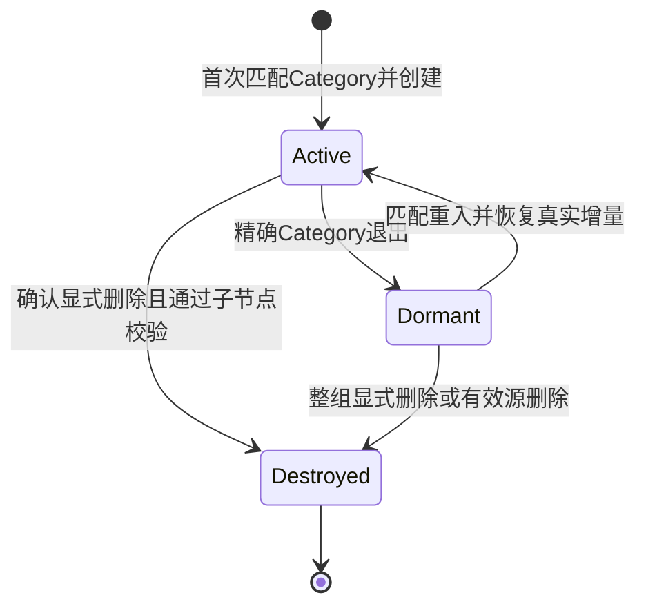

# DE-WBS 前后端开发 PRD v3

> 基线日期：2026-09-21  
> 读者：产品、前端、后端、测试、技术负责人  
> 产品范围：当日全部确认改动，以及 IO IP / Analog IP 的完整功能、关联和交互  
> 文档性质：已确认产品规则的开发汇总；技术方案与未决事项单独标注，不将建议视为已确认需求  
> 原型：[DE-WBS-prototype-v1.html](DE-WBS-prototype-v1.html)  
> 决策依据：[decisions.json](decisions.json)、[CONTEXT.md](CONTEXT.md)、[data-model.md](data-model.md)、[qa-log.md](qa-log.md)  
> 历史对照：[DE-WBS-development-PRD-v2.md](DE-WBS-development-PRD-v2.md)。v2 与本文冲突时，不再作为当前开发要求。

## 0. 阅读与交付约定

### 0.1 需求状态与优先级

| 标记 | 含义 | 开发处理 |
|---|---|---|
| 已确认 | 用户明确确认的业务、布局和交互规则 | 纳入实现与验收 |
| 原型现状 | 当前 HTML 已实现的表现或限制 | 用于复现；不等同于生产架构已经定案 |
| 技术建议 | 本文提出的模型、接口、并发或部署方案 | 技术评审后确定，不新增可见业务流程 |
| 待定 | 尚未获得产品确认的规则 | 不得猜测；使用文末明确的降级边界与阻塞清单 |

来源优先级：最新用户确认 > 当前有效 decisions > CONTEXT / data-model > 当前原型实现 > 历史 PRD / 历史对话。旧文档内的搜索框、固定 Project、混合导入、任意 Version 操作、所有内置 Category 禁改等描述已经被后续确认取代。

### 0.2 产品与技术边界

- 面向 DRAM Design & Layout 部门，覆盖 Block-level Schematic/Layout 至 Block signoff，以及独立 SPF 和 IO IP/Analog IP 流程；不扩展到 tape-out、silicon debug。
- 规模基线为 100+ unique Blocks、40+ 人、多 Project；不同 Project 的数据、候选、关联和历史必须隔离。
- 不设计独立 Instance 实体，不建立跨 Project IP registry 或跨 Project ECO 扩散。
- Schematic/Layout 共享 Block 节点及冻结身份，业务 rail 独立；SPF 是独立表类型及层级，不能用名称推断类型。
- 原型使用内存数据，切换上下文保留，刷新重置。生产持久化、用户身份和权限映射必须单独实现，不得宣称单文件原型已具备后端能力。
- 本文不新增 Owner 停用、审批、通知订阅、任意自定义字段、独立日历配置页或额外侧边栏入口。

### 0.3 本次交付的开发原则

1. 功能必须覆盖表格、详情、草稿、导入、当前与未显示 Version，不只修改眼前 DOM。
2. 后端按稳定 ID 定位 Project、表、Block、Version 和来源链接；名称、路径和 Version 文案不是跨表关联键。
3. 候选管理、Category 投影、删除与导入必须整体成功或整体失败；失败不留下半更新状态。
4. 客户端选择状态不等于字段编辑。切换 Version 不得刷新未变化的公共值、抹掉特殊表覆盖值或制造编辑历史。
5. 本文接口及存储名称是技术建议；已确认的事务边界、隔离和可观察行为不能因实现差异而改变。

### 0.4 核验基线

- 原型 SHA-256：`67eb65ff15cf9454b0645dc467c4311f772362bb2cb194cc7d5306194e66895c`。
- 当前验收记录：174 组 Edge 原型回归通过，零运行时异常；这是原型交互证据，不是生产后端、负载、安全或权限测试结论。
- 本次仅编写开发文档，不修改原型，不重新定义已确认规则。

## 1. 2026-09-21 改动总表

以下为当日最终状态，必须与后文详细规则一起实现。

| 编号 | 功能/改动 | 最终行为与取代内容 | 详见 |
|---|---|---|---|
| CHG-01 | 系统建议 | 右上新增菜单：提交反馈、一键入群；链接待提供，不编造目的地 | 2 |
| CHG-02 | 删除全局帮助 | 删除右上 Help 问号；表头计算规则问号保留 | 2 |
| CHG-03 | Project 创建 | 新 Project 空白起步，不复制 DDCPC 的表、Block、候选人员或历史 | 3 |
| CHG-04 | 表类型拆分 | design = Schematic/Layout；spf = 独立 SPF，类型由元数据确定 | 3 |
| CHG-05 | LPTOP5 | 承接已有 SPF；ChanEdgel/ChanLeft/ChanMid 仅有设计双视图 | 3 |
| CHG-06 | 多表和命名 | 同 Project 可建多张任意名称的 SPF 表；跨类型表名不可重复 | 3 |
| CHG-07 | Project 切换器 | 无搜索，仅项目列表；新增 Project 的 + 移到选择器旁常显 | 3 |
| CHG-08 | 新建表和首个 Block | 独立表名称 +；空表从 Block 列首行入口创建 T1 | 3、4 |
| CHG-09 | 顶栏分隔线 | Project + 后、表名称前，1px × 20px，左右各 12px | 2 |
| CHG-10 | Check Block 树 | 与 WBS 同一 Parent 前序/缩进/箭头/Tn；独立 Tier 列改 Version | 5 |
| CHG-11 | Check 明细可编辑 | Item 方框可操作，与 Drawer/WBS 双向同步并遵循层级门禁 | 5 |
| CHG-12 | Block 对齐 | 首个可见 hierarchy 文本、Block 表头和根名称共享 19px 内缩 | 2、5 |
| CHG-13 | Check 列筛选 | 每列使用共享多选筛选；删除独立状态筛选，SPF 同等支持 | 5 |
| CHG-14 | Item 对齐与精简 | 方框在标题内容区居中；删每 Item 小统计字幕、完成度列 | 5 |
| CHG-15 | 特殊表入口按需出现 | 创建普通表不创建可见空 IO/Analog 入口；首次成功投影才出现 | 9 |
| CHG-16 | 空特殊入口隐藏 | 无任何 active 记录时隐藏入口，不删除 dormant 工作流 | 9、12 |
| CHG-17 | 两套 Excel 模板 | 一文件创建一张对应类型表；不兼容旧三业务 Sheet 混合模板 | 8 |
| CHG-18 | 单页直接导入 | 无步骤条、预览/校验预览、摘要确认和单独成功页 | 8 |
| CHG-19 | 导入页面样式 | 等宽区域、128px 框、36px 控件、紧凑字号；错误在上传下方 | 8 |
| CHG-20 | 下载按钮入框 | 两种模板下载按钮都在下载框中居中，与上传选文件按钮对齐 | 8 |
| CHG-21 | Layout 计算日期 | Plan finish 只读；Resource 默认 1；中国年度工作日历，含调休 | 6 |
| CHG-22 | 日期清空 | 除普通 Layout Plan finish 外，日历字段可清空；锁定 Planned release 也可清空 | 6、10、11 |
| CHG-23 | 配置范围和名称 | 同 Project 所有适用表共享；名称统一为 WBS字段配置；不采纳按表独立配置 | 7 |
| CHG-24 | 两个配置 Tab 一致 | 统一列表/CRUD；新增按钮含字段名；普通默认 Category 可改删 | 7 |
| CHG-25 | 保留 Category | 只有 IO IP/Analog IP 不可改名/删除，其他已用项先替换后删除 | 7 |
| CHG-26 | 类型文字对齐 | 系统保留/项目候选文字与表头对齐，锁图标单独前置 | 7 |
| CHG-27 | 页面搜索删除 | 删除 WBS、Check item 页面搜索及隐藏过滤依赖；保留列筛选和候选搜索 | 4、5 |
| CHG-28 | Delay 按钮删除 | 删除按延误天数排序按钮；默认降序、分类和查看 Block 保留 | 6 |

## 2. 页面结构、布局与视觉基线

### 2.1 导航与信息架构 [已确认]

```text
全局：Project 选择器 + 新增 Project | 表名称分段选择 + 新建表
右侧：通知 / 系统建议 / 当前用户身份
侧栏：Fullchip 总览 / WBS Hierarchy / Delay 监控
WBS Hierarchy 子视图：WBS字段配置、Excel 导入
Fullchip 子视图：Check item 明细
覆盖层：Block Drawer、列筛选、历史 Popover、确认/校验 Modal
```

- WBS字段配置、Excel 导入不是新的侧栏入口；保留 WBS Hierarchy 选中，提供返回按钮。
- 普通设计表显示 Schematic/Layout Tabs；SPF 表仅显示 SPF；IO/Analog 隐藏三种 hierarchy Tabs。
- 表名称分段选择是切换业务表，不是切换 Project 或 Block 状态。
- 主页面变化、表变化、hierarchy 变化要关闭旧 Drawer、旧弹窗上下文及旧事件处理；旧 DOM 不得写入新上下文。

### 2.2 全局样式与尺寸 [已确认/原型现状]

| 元素 | 展示要求 |
|---|---|
| 风格 | 既有 W01 / Precision Blue 及当前浅色工程工作台样式；不重新做营销页风格 |
| 主色 | 常规操作/选中/焦点蓝色 `#0052D9`；Hover `#003FA8`；紫色不用于普通功能 |
| Sidebar | 展开 224px、折叠 64px；保存偏好；底部仅居中折叠图标 |
| 用户身份 | 顶栏右侧头像、显示名、角色；不再放侧栏底部 |
| 表名称条 | 水平分段单选、当前项蓝色；空间不足只让该控件横向滚动 |
| 分隔线 | 新增 Project + 后、表名称前；浅灰 1px × 20px，垂直居中、两侧净距各 12px，不可交互、不获焦 |
| 表格编辑器 | 默认值展示；Hover/Focus 才显示编辑器；30px 白色控件、灰边 1px、圆角 5px、统一内距/箭头 |
| 状态 | 仅展示层带状态颜色；编辑层不因状态改变边框或底色 |
| 行操作 | +、垃圾桶依次排列，22px × 22px；Hover/键盘 Focus 才显示；无独立操作列 |
| 桌面适配基线 | 原型最小页面宽度 1180px；验收 1180px/1440px、两种侧栏状态；窄于最小宽度不假设是已承诺移动端适配 |

具体颜色、阴影、字号和圆角以当前原型相应组件 CSS 为准；继承组件不另起一套主题。生产 CSS 可组件化，但冻结列、按钮占位和文本不重叠属于验收条件。

### 2.3 系统建议与帮助 [CHG-01、02]

1. 顶栏通知后、用户身份前显示「系统建议」图标+文字按钮；删除全局 Help 问号。
2. 点击展开两项：`提交反馈`、`一键入群`；再点关闭，外部点击关闭，Esc 关闭并将焦点返回触发按钮。
3. 点击任一项后菜单关闭；原型仅反馈提示。正式反馈地址、入群链接和打开方式待提供，不能生成虚假链接。
4. 计算规则 `?` 属于字段说明，不随全局 Help 删除；Hover/Focus 展开、离开/Blur 关闭、点击固定。
5. 通知入口保留；本次没有确认新的通知规则、接收对象或推送机制。

## 3. Project 与表管理

### 3.1 Project 新增与切换 [CHG-03、07]

| 环节 | 前端逻辑/交互 | 后端必须保证的业务结果 |
|---|---|---|
| 打开选择器 | 展示全部项目名称，当前项选中并获焦；无搜索、无列表内新增按钮；长列表内部滚动 | 仅返回用户可访问项目；具体授权来源待定 |
| 键盘 | ↑/↓/Home/End 移动，激活后切换，Esc 返回触发器 | 切换本身不是业务记录修改 |
| 新增 Project | 选择器旁常显 32px +；Tooltip/aria-label 为新增 Project；页内名称 Modal | trim、大小写不敏感去重；原型全项目名唯一，生产组织/租户命名边界待定 |
| 确认新增 | 成功后选中新 Project，进入空 WBS；失败留 Modal、名称不丢失 | 空表集、空业务数据、空历史；初始化 Category 默认集，Reference/Owner 候选空白 |
| 取消 | Cancel、关闭、背景或 Esc 退出；不新增项目 | 不产生业务数据 |
| 切换 | 先提交待保存的 Category，检查 Block/导入草稿；需要时请求明确丢弃确认 | Project 的表、Version、active/dormant 特殊数据、关联、历史、候选、锁均隔离 |

新增 Project 的默认 Category 为 DFT、Analog IP、Fuse、Data path、DqByte、Banklogic、Xdec+Ydec、Row+Refresh+RHR、IO IP、Controller、DLDO；允许字段为空，不把“空”存成业务名称。其他 Project 对普通默认项的修改不能污染这份初始化种子。

### 3.2 新建表与所有权 [CHG-04、05、06、08]

- 顶栏表名称条后的独立 + 打开「新建表」Modal，与 Project + 不混用。
- 必填表名称；选择 `Schematic / Layout` 或 `SPF`。不提供 IO IP/Analog IP 手建类型。
- Project 内跨类型名称 trim 后大小写不敏感唯一；不同 Project 可同名；`IO IP`、`Analog IP` 保留给系统特殊表。
- SPF 可多张、可任意合法名称；LPTOP5 不是单例约束。
- 初始 DDCPC：ChanEdgel、ChanLeft、ChanMid 属于 design；LPTOP5 属于 spf，并保留原 SPF 所有 Version、Owners、检查、日期、文件路径和历史。
- design 创建共享的 Schematic/Layout 身份空间与独立空 rail；spf 创建独立层级。不得通过表名包含 LPTOP5 等字符串判断类型。
- 空表显示首个 Block 创建行；T1、无 Parent、Block 名必填、Version 可空，首个非空仅 1st。SPF 的首行占 12 列，Block 单元格常显 22px +，只有直接 Hover + 才显示「新增 Block」，不移动按钮。
- 表名条点击立即切换，支持 Left/Right/Home/End；新导入表加入同一条，隐藏特殊表不占键盘导航位置。
- 切换回来恢复该表选中的 Version、节点状态和数据；列筛选按既定规则重置；未提交草稿按确认结果处理。

### 3.3 上下文隔离与未提交数据

前端每个请求/Drawer/草稿持有 `{projectId, tableId, hierarchy?, nodeId?, versionId?, contextToken}`。这是建议的技术表示；已确认的行为是旧上下文不能写新上下文。

1. 请求返回时核对上下文及当前对象是否仍存在；切 Project、切类型或取消后忽略迟到响应。
2. 有未完成 Block/导入草稿时，取消离开要保留输入；明确丢弃才切换。
3. 日期/Owner/Category 等编辑失败恢复相应字段和关联结果，不把显示值留在模型以外。
4. 异步草稿 autofocus 不得抢走确认 Modal 或 Project 列表焦点。
5. 后端不可只凭客户端 contextToken 授权；须再次验证 Project 归属与对象有效性。

## 4. 普通 WBS 与通用表格交互

### 4.1 页面排列与列顺序

- 页头右侧依次为次要 `WBS字段配置`、主要 `导入 Excel 表格`；不恢复表头 Add Block、全部折叠、导出当前视图。
- 下一行 hierarchy Tabs，最右侧 32px 无框最大化图标。已删除页面搜索，不保留隐藏搜索值、空工具栏或 query 过滤条件。
- Schematic 顺序：Block、Version、Block Category、Reference project、Schematic Progress、Planned release、Actual release、Schematic Owner、Check item、Schematic check status、Layout Progress、最近修改。
- Layout 顺序：Block、Version、Block Category、Reference project、Schematic Progress、Layout Owner、Plan workdays、Resource、Start date、Plan finish、Actual finish、Layout Progress、Check item、Layout check status、最近修改。
- SPF 顺序：Block、Version、Schematic Owner、Layout Owner、Check item、SPF check status、LVS path、cdl、gds、Planned SPF release、Actual SPF release、最近修改。
- Schematic/Layout 冻结前四列且宽度、身份值、筛选和 Version 选择一致；SPF 冻结 Block/Version。业务 rail 不互相复制。
- Block 基础最小宽 165px；Category 100px、普通 Reference 105px、Version 100px。编辑日期运行时最小 160px；自动 Plan finish 保留紧凑宽度。其他最小宽度须满足完整两行表头，不是任意压缩。

### 4.2 层级、Version 和新增

| 功能 | 逻辑、交互与约束 |
|---|---|
| 树顺序 | 按 Parent 定义深度优先前序；父后紧接完整后代，不能全局按 Tier 排序 |
| 节点归属 | Parent、Tier、排序、展开状态属于 Block Node；同节点全部 Version 共享 |
| 展开箭头 | 只有存在实际本地子节点才显示；叶子留隐藏 16px 对齐槽；每层缩进 17px |
| 行内标识 | 名称后显示 Tn，不展示 Layout 内部 TOP，不显示 Instance/Definition IDs 或重复放置标记 |
| 行 + | 点击当前节点为固定锚点，菜单两项：添加 Version、添加 Block；两项共用32px左槽大无框 + |
| Add Block | 草稿内 Block 名必填、Version 可空；Tier 仅同级/下一级；无 Parent picker、无复用 Definition |
| 插入位置 | 同级放在锚点完整子树之后；下一级放在锚点之后成为首个子节点；所有 Versions 的后代都参与边界计算 |
| Add Version | 仅最大已有非空标签的下一版；其他标签禁用；最高5th停用；提示下一版或已达到最高 Version |
| 空 Version | 首次非空仅1st；初始化已有空记录时原地修改，不覆盖字段或产生重复节点 |
| 选择已有 Version | 平时显示纯文本，Hover/Focus才出现现存记录选择器；切换整行及Drawer数据，不改层级、不重命名Version |
| 重复键 | 手工/导入校验 normalized raw Block name + Tier + Version；精确三元重复阻止，草稿保留 |
| 删除 | 只允许从最高Version向下连续后缀；全部选中升级为整个Block删除并二次确认；有子节点不能删最后记录 |

历史导入允许 Version 不连续，不能自动补齐、重编号；自动特殊投影不受手工顺序创建约束。角色权限不能凭版本号自行增加。

### 4.3 列筛选、列宽与全屏 [CHG-27]

1. 所有非日期列（除最近修改）有固定漏斗；菜单包含全选、空白、去重候选、多选、清除/应用和取消。
2. 菜单顶部为自动获焦的无框模糊搜索，Placeholder 只有字段名，不附加「筛选」；页面搜索删除不影响此输入。
3. 同列候选按 OR、多列按 AND；不再叠加全局 Block 搜索。清除恢复该列全部值，取消不修改已应用筛选。
4. 筛选不修改 selected Version 或数据；被编辑行不再匹配时立即离开结果。空结果使用筛选提示，不再要求调整搜索词。
5. Schematic/Layout 冻结身份筛选共享，业务筛选分别保存；SPF、IO、Analog 独立。表切换/导入清空筛选。
6. 每列边界 2px 灰线，12px 命中区在本列内；Hover/Focus/拖动变蓝；拖动仅调整宽度，不打开筛选；键盘 Left/Right 可调整。
7. 标签宽时一行、窄时最多完整两行；不得靠省略号掩盖表头字段。冻结偏移与组表头宽度同步更新。
8. 全屏为表容器覆盖视口，不依赖浏览器 Fullscreen API。保留所有表格操作；宽视口按比例扩展业务列，窄视口横滚；Esc/最小化退出恢复保存宽度。
9. 对齐：第一可见 hierarchy 标签、Block 表头、根 Block 名称的共同内缩为19px；子级继续17px缩进。隐藏的Tab不得占位。

## 5. Fullchip 与 Check item 明细

### 5.1 Fullchip 入口和统计

- 指标卡仅指标名和数值，保留数值状态色；不恢复卡内说明和右上装饰符号。
- Check item progress 的「查看全部」及 hierarchy 汇总行点击进入明细；Hover 只展示各检查类型计数。
- Check明细已按逻辑Block当前Version显示；Fullchip原型目前仍通过Definition ID去重后统计底层记录，多Version时可能与明细数量不同。把汇总也统一成逻辑Block/当前Version是技术与产品待评审项，不能在本PRD中冒充已确认改动；见OPEN-16与GAP-02。
- 当前表不具备的 hierarchy 不显示为可选页签；切换表后刷新正在打开的明细。

### 5.2 明细字段与布局 [CHG-10 至 14、27]

| 视图 | 列顺序 | 列数 |
|---|---|---|
| Schematic | Block、Version、Schematic Owner、5个Item、Schematic check status | 9 |
| Layout | Block、Version、Layout Owner、4个Item、Layout check status | 8 |
| SPF | Block、Version、Schematic Owner、Layout Owner、5个Item、SPF check status | 10 |

- 页头标题 Check item 明细，返回 Fullchip；紧凑内容宽度 Tabs 下直接是表格。
- 无页面搜索、独立状态筛选、完成度列、Check-type下拉、结果数量文案；每个Item表头无“5/7 completed”等小字幕。保留Tab汇总计数。
- Block列复用WBS树结构：Parent前序、展开箭头、17px缩进、名称、行内Tn；不放WBS +/垃圾桶。Version取当前选中记录，无独立Tier列。
- 冻结身份列；每个可见列提供与WBS一致的筛选按钮，包括Item的Done/Not done、最终状态、空Owner等。
- 明细筛选独立于WBS并按hierarchy保存；表切换/导入清空；不因筛选更改数据。
- Item标题与方框均在扣除右侧38px筛选操作区域后的内容区居中；多行标题、横滚、SPF和侧栏折叠均不改变对齐。
- 点击Block打开精确Version的现有Drawer并聚焦Check items；其他身份字段只读。

### 5.3 检查项定义和编辑

| hierarchy | 已确认检查项 |
|---|---|
| Schematic | Power mapping；ERC；Fanout；CN marker；Verification (Verilog & Finesim) |
| Layout | Floorplan Reviewed；IO 满足上层需求；Power 合理并满足上层需求；Verification (DRC/LVS) |
| SPF | UT DRC；MRC / shielding check；LN net；LRC；Duplicate pin |

每项为一个可点击/键盘触发方框，已完成显示一个勾，`aria-pressed`与值同步。WBS、明细、Drawer共享同一编辑入口和精确Version，不维护各自副本。

1. 点击未完成项请求完成，点击完成项请求重开；成功后刷新方框、最终check status、汇总和已打开详情。
2. Parent完成最后一个未完成项前，所有直接子Block必须完成全部检查；否则不保存，Modal列出子Block和缺失Item。点击列表Block打开其Drawer并聚焦检查区域。
3. 子Block重开后，已完成祖先自动重开，递归向上；不能保留“父Done、子未完成”。
4. 同名不同Tier记录具有独立rail；若状态变化与其他Tier同名Block不同，弹出仅当前/同步受影响Tier的选择。确认同步也不能绕过Parent最终项门禁。
5. 最终check status：所有Item完成为Done，否则Ongoing；不能手选。新增检查项与新门禁未获部门评审前不加。
6. Item编辑可令当前行不再匹配列筛选，立即从结果移除；空状态colspan与9/8/10列一致。
7. 后端重做门禁和跨Tier目标校验；前端禁用/提示不能替代服务端校验。冲突时不留下部分同步。

## 6. 日期、排期与 Delay

### 6.1 普通 Layout Plan finish [CHG-21]

**已确认公式**：`Plan finish = Start date + Plan workdays / Resource`，按中国工作日历推进。不是自然日加法，也不是特殊表所有 Planned finish 的通用公式。

- Resource默认1；仍可按既有输入标准填写带符号小数。新Layout记录、演示记录及空Resource导入使用默认1；已有空Version初始化必须保留已输入Resource。
- Plan workdays/Actual workdays只接受整数，后者不在WBS列中，仅详情存储/显示。
- Plan finish在普通Layout行、Add Block/Version草稿和详情只读，无日历、无清空按钮；直接写入请求必须拒绝。
- 修改Start date、Plan workdays、Resource后重新计算；清空Start date导致结果空白，Progress/Delay联动。
- Excel保留原Layout列结构，但上传的Plan finish不是权威值，以参数计算替代，不能绕过只读。
- 原型按Start date之后的工作日累计；工作量0返回Start date。生产零值、开始日处于休息日的口径若要改变须另行确认，不得暗改原型语义。

### 6.2 年度中国工作日历

- 已确认从2026年起按年份映射，含法定休息和调休补班，不展示日历配置页。
- 2026内置已核验数据：[国务院公告](https://www.gov.cn/zhengce/zhengceku/202511/content_7047091.htm)。常规周末休息，但官方补班日优先；法定放假覆盖普通工作日。
- 原型使用 `holiday-cn` 年度JSON，后续年份按需加载、校验年份/公告来源/日期格式，8秒超时、同年请求去重，失败不阻塞其他表格操作。
- 年份未发布、加载失败或2026以前没有映射时结果留空，不猜一个“仅跳周末”的日期。原型重新加载可重试失败年份；生产自动刷新/运维更新周期属于技术方案。
- **待定**：商除后是小数工作日如何取整。当前不向上/向下取整，结果留空并提示规则待确认。
- 缺参数、Resource≤0或无效数值暂不生成日期；这不是新增角色限制，输入Resource的既有能力保留。
- 技术建议：后端维护版本化年度日历缓存，权威计算返回`value/reason/calendarVersion`；前端不依赖第三方CDN保证生产正确性。使用无时区日历日期运算，避免DST/UTC偏移改变日期。

| 输入例子 | 当前应得结果 |
|---|---|
| 2026-09-30，1 workday，Resource1 | 2026-10-08，跳过国庆 |
| 2026-10-09，1 workday，Resource1 | 2026-10-10，补班周六 |
| 2026-02-13，2 workdays，Resource1 | 2026-02-24，先计2/14补班再跳春节 |
| 2026-09-01，5 workdays，Resource2 | 空，2.5工作日规则待定 |

### 6.3 日期清空和 Planned release 锁 [CHG-22]

1. 普通Schematic/Layout/SPF、IO/Analog所有可选择日期在有值时显示独立「清空日期」×图标；Hover/Focus编辑态出现，有Tooltip和可访问名称。
2. 清空写空值，不删除行、Version或源关联；再填写可正常保存。所有字段都使用原有保存/历史入口，保持Project/表/Version隔离。
3. 普通Layout Plan finish是唯一此处的只读例外；特殊表中同名Plan finish仍可手填和清空。
4. Schematic Planned release默认锁定：空白可以填；已有非空不能直接换另一个日期；但此次确认允许锁定时清空，再填写空白。
5. 只有PL/LPL可切换该列锁，解锁后所有用户可编辑已有值；锁按设计表保存，导入新表默认锁定。生产PL/LPL与真实用户映射待定。
6. 日期展示`YYYY-MM-DD`，空时视觉留白。日期、日历图标、清空按钮不得挤压；原型可编辑日期列运行时最小160px，不覆写用户已保存宽度。

### 6.4 Progress 与 Delay [CHG-28]

| 对象 | 已确认计算 |
|---|---|
| 普通Schematic Progress | Planned release空→Not started；Actual晚于Planned→Delay；否则On schedule |
| 普通Layout Progress | 计算Plan finish空→Not started；Actual finish晚于Plan finish→Delay；否则On schedule |
| 特殊流程的派生Status | 任一日期空→空；Actual>Planned→Delay；否则On schedule，不使用Not started |
| 普通check status | Item全部完成→Done，否则Ongoing；独立于排期Progress |

Delay页面没有副标题和「按延误天数排序」按钮。Schematic Delay/Layout Delay两分类、计数、默认延误天数降序和「查看Block」保留。表列为Block、Hierarchy、Owner、计划日期、实际日期、延误、状态、查看动作；切分类分别显示Planned release/Actual release与Plan finish/Actual finish，单元格只写值。

原型实际Delay入选路径为`stateFor -> scheduleProgress`，目前需要Actual晚于计划日才会入选；未填Actual不会仅因TODAY过了计划日就自动进入列表。入选记录的延误数值表达式为`max(1, ceil((Actual或TODAY)-Planned))`的自然日差，其中TODAY固定`2026-08-25`；列表还沿用Definition ID去重。是否纳入未完成且超过计划日的记录、生产当前日/时区及跨Version统计口径须明确，见OPEN-09/16/17。本次删除排序按钮没有修改这些算法，开发不得擅自补成另一套逾期规则。

## 7. WBS字段配置

### 7.1 范围、布局与入口 [CHG-23 至 26]

- 页头次要入口和页面标题均为`WBS字段配置`，位于导入按钮前；返回WBS Hierarchy，不添加侧栏或hierarchy Tab。
- 配置按Project统一，切表名称不换候选池；不再采纳“每表一份枚举”的讨论方案。
- 顶部两个Tab：Block Category、Reference project；下方字段标题、Project名称、右侧主要新增按钮，再下方列表。
- 列顺序一致：枚举值、类型、使用数量、操作。常规行是项目候选，右侧无框铅笔/垃圾桶；两页共用字体、行高、间距和弹窗。
- 按钮分别为`新增 Block Category`、`新增 Reference project`，不使用模糊的“新增选项”。
- Category仅IO IP/Analog IP为系统保留且不可改名/删除；其他默认项、自定义项都可以管理。系统保留显示锁，不给可执行修改/删除入口，后端同样拒绝绕过调用。
- 类型列文字与表头同一左边缘；当前原型左内距22px，14px锁在文字前6px独立位置并垂直居中，不挤占文字流或伸入前列。
- SPF没有Category/Reference列，但可进入Project配置管理公共候选；不为SPF虚构这些业务字段。

### 7.2 新增、改名和删除

| 操作 | 输入/确认 | 数据处理 | 错误和恢复 |
|---|---|---|---|
| 新增 | Modal标题含字段名；输入名称，确认新增 | trim，拒空/大小写重复/保留名称；仅加入候选，不自动赋给已有Block | 留Modal和输入，不悄悄合并或创建重复项 |
| 改名 | 预填旧值；提示当前Project引用同步、历史保留 | 更新所有当前/存储Version、草稿、筛选、相关special值及恢复基线；追加正常字段历史，不重写旧事件 | 事务失败全回滚，输入保留可重试 |
| 未使用删除 | 只需确认，取消不动数据 | 移除当前Project候选 | 不影响其他Project初始化默认集 |
| 已使用删除 | 展示使用位置；必须选择另一已有非空候选，未选时确认禁用 | 先统一替换引用、审计、投影，再删候选 | Modal保留替代选择，回滚包括特殊active/dormant状态 |

使用数量覆盖所有Version，不仅当前可见行；Category按表+Definition Version去重Schematic/Layout共享身份，包含草稿与特殊删除恢复值；历史文本不是活引用。确认时重新计算使用范围，避免弹窗打开后新增引用逃过处理。

删除普通Category并替换为IO IP/Analog IP时，事务内生成/恢复精确特殊来源投影；不把整个特殊表清空重建。Reference也遵循同等增删改流程，但不触发Category成员变化。

### 7.3 下拉候选与 Owner

- Category/Reference普通、特殊、Add Block入口仅搜索和选择已登记值；输入未匹配、Enter、Blur、取消不能隐式新建。
- 搜索弹窗挂body层避免冻结列裁切；支持IME、键盘上下选择、Enter、Esc、Tab和清空。
- Schematic Owner/Layout Owner保持两个Project级池，SPF复用两池，Layout quality check Owner用Layout池。
- Owner不增加配置Tab。未匹配非空输入显示明确`新增并使用`，创建后赋给当前字段；创建候选本身不写独立生命周期日志，实际换Owner按正常字段历史记录。
- 生产人员稳定ID/目录接入待定；不能以“改一个候选显示名”擅自建立人员停用/转交流程。

## 8. Excel 单页导入

### 8.1 页面状态和视觉 [CHG-17 至 20]

1. 点击「导入 Excel 表格」进入主HTML内的完整导入子页，不跳独立参考原型。
2. 同页从上到下：标题/返回；表内容类型、新表名称；左右等宽下载/上传区；上传文件名/错误区；右下`导入并创建新表`。
3. 类型和名称控件36px；对应标签同基线。下载/上传框128px高，框内内容居中、12px间距；下载按钮在下载框内，上传按钮为选择已填写模板/重新选择文件。
4. 区域标题14px/600，正文按钮13px，标签/错误12px、次要文字11px。页面区块不套多层装饰卡；长文件名、表名、错误安全换行。
5. 不显示步骤条、文件预览、逐行校验预览、摘要确认或独立成功页。
6. 提交后文案`正在导入…`，`aria-busy`，禁用表单重复提交；读取文件时也不可提交。
7. 成功立即选择新表并进入WBS，Toast导入成功；失败留同页，保留类型、名称、已读工作簿和文件名，上传区下显示可聚焦错误列表。
8. 文件读失败清理不可用工作簿，但保留类型、名称、文件名供重选。错误列表滚动上限220px，不无限拉长页面。

### 8.2 两套固定契约

| 类型 | 下载文件 | 数据Sheet | 数据要求 |
|---|---|---|---|
| design | `WBS_Schematic_Layout_Import_Template.xlsx` | Schematic、Layout；另有填写说明 | 两张业务Sheet必须存在，可有一张仅表头，合计至少一条有效数据 |
| spf | `WBS_SPF_Import_Template.xlsx` | SPF；另有填写说明 | SPF至少一条有效数据，创建独立任意合法名称表 |

填写说明在生成时存在，上传可缺省；其他Sheet不是自由扩展区。拒绝旧Schematic/Layout/SPF混合文件，即使多余Sheet为空；拒绝缺失/额外业务Sheet、改名Sheet、表头列数/名称/顺序不符。不提供字段/Tier/Sheet映射和向已有表合并。

| Sheet | 精确列顺序；Item展开为本PRD第5章对应完整名称 |
|---|---|
| Schematic | Tier1～Tier6、Version、Block Category、Reference project、Schematic Owner、Planned release、Actual release、5个Item |
| Layout | Tier1～Tier6、Version、Block Category、Reference project、Layout Owner、Start date、Plan finish、Actual finish、Plan workdays、Actual workdays、Resource、4个Item |
| SPF | Tier1～Tier4、Version、Schematic Owner、Layout Owner、LVS path、cdl、gds、Planned SPF release、Actual SPF release、5个Item |

### 8.3 校验和写入

- 每行仅当前Tier列填写本Block名；父行在前，子行可省略重复父路径；不能跳级、无父或产生环。
- Version必填，仅1st～5th；允许历史不连续标签；同hierarchy精确name+Tier+Version重复阻止。
- Category/Reference/Owner使用当前Project登记候选，未知值不自动创建。当前导入Category按登记文案精确匹配，Reference及Owner按trim/大小写不敏感匹配；Schematic Owner与Layout Owner分别校验各自候选池，不能用两池并集替代。生产人员ID匹配需目录方案确定。
- 日期必须有效`YYYY-MM-DD`；工时整数，Resource按数值规则；Check接受既有完成标记（如1/Yes/Done/✓），原型其他/空值视为未完成。若生产改为严格拒绝未知Check文本，须另确认。
- design取两Sheet冻结身份并集，缺另一侧时创建共享身份和空业务rail（Layout仍适用Resource默认1）。Parent或同一身份的非空Category/Reference冲突必须报错，不静默选某张Sheet覆盖。
- 提交时重新解析/校验工作簿、项目上下文、表名唯一性，不能只信任前端缓存结果。
- 原型错误条目结构`{sheet,row,field,message}`，row为真实Excel物理行，包含表头与中间空行。全局文件/名称错误可无sheet/row。
- 创建表、节点、全部Versions、rails、候选引用、默认Resource、计算日期、锁状态、特殊Category投影及入口发现必须整体提交。失败不留下空表或部分IO/Analog数据。
- Type切换保留新表名称但清空已上传文件/解析/错误；迟到读取结果无效。切Project、离开导入页或打开上下文丢弃确认后，待提交不能悄悄建表。
- SheetJS仅Excel操作首次异步加载，12秒上限、失败可重试；阻塞CDN不能阻塞WBS、特殊表或非Excel操作。生产推荐服务端解析，模板契约保持一致。

## 9. IO IP / Analog IP 总体页面契约

### 9.1 特殊表性质与入口 [SP-01]

- IO IP与Analog IP是当前Project下的两个系统特殊流程视图，不是hierarchy类型，不是两份普通表，也不是跨Project复用库。
- 创建普通design/spf表不自动露出空特殊入口。某精确源Version成功进入对应Category并完成投影事务后，仅出现对应入口；不自动离开源表。
- 未编辑演示数据的所有普通表底层Versions都没有预选IO IP/Analog IP，所以初始两特殊表无独立示例行、无示例历史、入口隐藏。
- 普通草稿未确认、失败回滚、非匹配Category和SPF-only导入不能使入口出现。
- 入口显示条件为该Project对应特殊表存在至少一条active记录，包括独立手工行；不是“有已登记入口”，也不是“当前筛选下可见一行”。
- active记录变0时隐藏入口，保留登记、区域顺序、dormant记录、字段、历史、基线、选择和排序槽；重入时恢复。隐藏入口不响应直接切换及键盘导航。
- 当前正在查看的特殊表变空时关闭旧详情/菜单，回到该Project最近普通表；不能继续显示不存在的选中项。
- 表内筛选、折叠、选中Version不会导致入口隐藏。另一来源、另一匹配Version或独立手工根仍活跃时入口保持。
- 特殊表没有独立空白创建行、没有表头Add Block或Excel导入；首行必须来自普通Category投影，之后通过行+新增。

### 9.2 页面与冻结布局 [SP-02]

1. 仍位于WBS Hierarchy外壳；表名称条选择IO IP或Analog IP，隐藏Schematic/Layout/SPF Tabs和导入按钮。页面搜索已删除，不留下查询条件。
2. 两层组表头：第一层业务阶段组，第二层具体字段；公共身份列及单字段组跨两行。组标题不带独立筛选。
3. 冻结区严格按Source、Block、Version、Reference project、Schematic owner、Layout owner排列，最后边界在Layout owner右侧。不要把Category加入特殊表。
4. IO共33列，Analog共31列，计入6个身份列和最近修改。每个表头、colgroup和数据单元格一一对应，Source rowspan是唯一特定视觉合并。
5. 右侧最近修改与普通表共用44px展开/8px边缘收起行为；不手动拉宽，无独立左分隔线，仅展开时轻阴影，前一业务列的2px调整线保留。
6. 所有叶列除最近修改均可调整宽度，最大600px；日期无过滤器，其他非日期有过滤器。冻结宽度、组宽、水平滚动和保存值实时一致。
7. 公共编辑字段平时纯文本或状态Pill，Hover/Focus出现30px统一编辑器；长内容不扩大行高。字段候选popup在body层，不能被冻结/全屏容器裁切。
8. 筛选候选来自active底层记录，不包括dormant；按所选Version展示行判断是否匹配。多列AND；Block按完整来源路径，Source按有效视觉来源，派生状态按展示值筛选。
9. IO与Analog列宽分别保存；列筛选分别保存并在切表时清空。隐藏数据不参与候选列表，但仍参与其Version保留规则和删除子树保护。

### 9.3 Source 合并与路径 [SP-03]

- 派生行Source显示来源普通表名；原始来源仍由稳定ID决定。独立手工行真实Source为空。
- 连续可见、非空、相同有效Source区域合并为一个rowspan单元格，只写一次来源名；不同区域不能跨行强行合并。
- 有效Source按真实来源、手工视觉区域、最近本地Parent区域依次取值；手工行可视觉上处在ChanEdgel区域，但不因此获得源Definition链接，详情Source仍空。
- 筛选、展开/收起、投影增删、Version显示和本地结构变更后重新计算rowspan；草稿阶段可暂不合并以保证输入列不移位。
- Block显示根至当前节点完整路径：`CE_TOP T1/CORE_ARRAY T2/BITCELL T3`；根为`CE_TOP T1`。每段名称与Tier之间一个空格，段间用`/`，不用`+`。
- 保留原始leaf名称作为身份数据；路径只是展示，不是唯一键。Filter、Tooltip和Drawer标题使用同一路径。
- 路径派生行没有来源树缩进、没有额外Tier徽标；T3/T4也可以是特殊表本地根。
- Block默认165px基础宽度可按路径运行时适配至600px，不能覆盖用户保存宽度；截断时Tooltip/详情能访问完整路径。

## 10. IO IP 完整字段字典

### 10.1 字段类型和保存约定

| 代号 | 值域与编辑方式 | 空值与状态 |
|---|---|---|
| DATE | 原生日历日期，`YYYY-MM-DD`，带清空按钮 | null/空展示留白；手动保存；不套普通Layout排期公式 |
| PROC | 单选：Ongoing、Done、Ongoing（delay） | 可空；用户编辑，不根据Deadline自动变更 |
| YESNO | 单选：Yes、No | 可空；不能变成勾选即删除/创建的结构命令 |
| TEXT | 自由文本 | 可空；不按状态枚举推断；未确认字数上限不能自定产品限制 |
| OWNER-S/L | 对应Project Schematic/Layout候选池 | 可搜索、清空、明确新增并使用 |
| REF | Project Reference project候选 | 选择/搜索/清空；新候选只能在字段配置创建 |
| CALC | 由该行该阶段两日期派生 | 任一空→空；Actual>Planned→Delay，否则On schedule；无编辑器 |

每次真实直接编辑（包括清空）只提交当前特殊Version对应字段；相同值不追加历史。成功刷新依赖状态、列筛选和详情，失败恢复显示/模型。后端不得按可见标题“Status”“Plan finish”定位字段，必须使用下表稳定key。

名称中含email的字段只记录YESNO或流程状态，本轮没有确认自动发邮件、解析邮箱或触发审批；Review AI也是用户输入内容，不意味着调用AI服务生成评审。不得据列名扩展外部自动化。

### 10.2 公共身份列（两表相同）

| 列序 | 原型key | 标签 | 编辑/来源 | 基础宽度px |
|---|---|---|---|---|
| 1 | `sourceTableName` | Source | 只读来源表名；视觉rowspan不修改真实来源 | 105 |
| 2 | `block` | Block | 路径/手工原始名称；点击详情、行+与垃圾桶；手工创建时输入，现有特殊详情不提供名称铅笔 | 165，可适配至600 |
| 3 | `version` | Version | 现有active版本选择器；非空不可改标签，空值首次1st；与源版本精确关联 | 100 |
| 4 | `referenceProject` | Reference project | REF；初投影继承，允许本地覆盖，后续仅真实源增量覆盖 | 115 |
| 5 | `schematicOwner` | Schematic owner | OWNER-S；同上 | 120 |
| 6 | `layoutOwner` | Layout owner | OWNER-L；同上 | 120 |

### 10.3 IO 业务列（顺序不可随意调整）

日期原schema最小108px，现因清空控件运行时最小160px；下表按当前有效编辑最小值列出。复杂表头字体实测可继续增大最低值，不能截断标题。

| 列序 | 阶段组 / 叶子标题 | 原型稳定key | 类型/特别规则 | 最小px |
|---|---|---|---|---|
| 7 | Hookup / Deadline | `hookupDeadline` | DATE | 160 |
| 8 | Hookup / Status | `hookupStatus` | PROC | 125 |
| 9 | Spec&Reviewb / Deadline | `specReviewDeadline` | DATE | 160 |
| 10 | Spec&Reviewb / Status | `specReviewStatus` | PROC | 125 |
| 11 | Pre_sim result CRC review / Deadline | `preSimDeadline` | DATE | 160 |
| 12 | Pre_sim result CRC review / Status | `preSimStatus` | PROC | 125 |
| 13 | Pre_sim result CRC review / Review AI | `preSimReviewAi` | 多行TEXT；表格预览，详情唯一可编辑特殊字段 | 125 |
| 14 | Pre_sim result CRC review / Status | `preSimReviewAiStatus` | PROC；独立于preSimStatus，详情标签Review AI Status | 125 |
| 15 | SCH release for Layout / Plan finish | `schReleasePlanFinish` | DATE，仍可编辑/清空 | 160 |
| 16 | SCH release for Layout / Actual finish | `schReleaseActualFinish` | DATE | 160 |
| 17 | SCH release for Layout / Status | `schReleaseStatus` | CALC，使用15/16列 | 125 |
| 18 | Co-work / Rls schematic email A1/A2（Designer填） | `coWorkRlsSchematicEmail` | YESNO | 190 |
| 19 | Co-work / Floorplan done email B（Layout填） | `coWorkFloorplanDoneEmail` | YESNO | 175 |
| 20 | Co-work / Floorplan confirm email B（Designer填） | `coWorkFloorplanConfirmEmail` | YESNO | 190 |
| 21 | Co-work / Layout Status | `coWorkLayoutStatus` | PROC | 130 |
| 22 | Co-work / Layout routing check with design | `coWorkRoutingCheck` | 原型TEXT；生产最终类型待确认，不预设枚举 | 175 |
| 23 | Co-work / Routing done email D（Layout填） | `coWorkRoutingDoneEmail` | YESNO | 175 |
| 24 | Layout finish status（for layout）/ Planned finish | `layoutFinishPlanned` | DATE | 160 |
| 25 | Layout finish status（for layout）/ Actual finish | `layoutFinishActual` | DATE | 160 |
| 26 | Layout finish status（for layout）/ Status | `layoutFinishStatus` | CALC，使用24/25列 | 125 |
| 27 | Layout modify email E3（Designer填） | `layoutModifyEmail` | YESNO，无结构副作用 | 165 |
| 28 | Layout quality check（matching&shielding）/ Owner | `qualityOwner` | OWNER-L，不是新增第三种人员池 | 120 |
| 29 | 同组 / Deadline | `qualityDeadline` | DATE | 160 |
| 30 | 同组 / Status | `qualityStatus` | PROC | 125 |
| 31 | Post_sim result CRC review / Deadline | `postSimDeadline` | DATE | 160 |
| 32 | 同组 / Status | `postSimStatus` | PROC | 125 |
| 33 | 最近修改 | `latestChange` | 当前Version直接历史入口，不是业务可写字段 | 44/8 |

Co-work完整组名为`Schematic and Layout Co-work flow Check`。六项可见标题和详情标签均不带1.～6.前缀，稳定字段key不变。不得把这些YESNO项与普通hierarchy的底层Check门禁混为同一个系统。

### 10.4 IO 特别交互 [SP-04]

- Review AI表格默认紧凑摘要；Hover或键盘Focus出现页内完整内容浮层，保持换行、长内容可滚动；内联textarea仍可编辑，不被浮层抢焦点。
- Preview定位在视口范围，原型最大宽420px、根据上下可用空间放置。滚动、切表、离开上下文关闭，不能显示另一个Version的旧内容。
- Drawer内Review AI占整行多行textarea，change/blur保存，去重避免同一次改动重复历史；保存回写表格当前记录，保留Drawer滚动。
- E3选择Yes、No或空只写`layoutModifyEmail`及直接字段历史；不弹删除确认、不创建同名行、不复制冻结字段、不改变排序/可删除性。
- PROC的Delay样式与派生Delay共用红色，但枚举值保持`Ongoing（delay）`；Done/On schedule绿色，Ongoing使用既有进行中色，空不画虚假状态。

## 11. Analog IP 完整字段字典

公共列1～6与第10.2节完全一致；Analog与IO数据集、历史、Version选择和本地工作流分别保存。

| 列序 | 阶段组 / 叶子标题 | 原型稳定key | 类型/特别规则 | 最小px |
|---|---|---|---|---|
| 7 | Release for layout drawing / Planned finish | `releasePlanned` | DATE | 160 |
| 8 | 同组 / Actual finish | `releaseActual` | DATE | 160 |
| 9 | 同组 / Status | `releaseStatus` | 原型TEXT；枚举、编辑类型、是否派生仍待确认 | 125 |
| 10 | Co-work / Rls schematic email A1/A2（Designer填） | `coWorkRlsSchematicEmail` | YESNO | 190 |
| 11 | Co-work / Floorplan done email B（Layout填） | `coWorkFloorplanDoneEmail` | YESNO | 175 |
| 12 | Co-work / Floorplan confirm email C（Designer填） | `coWorkFloorplanConfirmEmail` | YESNO；注意是C，IO为B | 190 |
| 13 | Co-work / Routing done email D（Layout填） | `coWorkRoutingDoneEmail` | YESNO | 175 |
| 14 | Layout finish status（for layout）/ Planned finish | `layoutFinishPlanned` | DATE | 160 |
| 15 | 同组 / Actual finish | `layoutFinishActual` | DATE | 160 |
| 16 | 同组 / Status | `layoutFinishStatus` | CALC，使用14/15列 | 125 |
| 17 | Layout modify email E3（Designer填） | `layoutModifyEmail` | YESNO，无结构副作用 | 165 |
| 18 | Layout quality check（matching&shielding）/ Owner | `qualityOwner` | OWNER-L | 120 |
| 19 | 同组 / Dea dline | `qualityDeadline` | DATE；原型此处标签有空格，不代表新字段 | 160 |
| 20 | 同组 / Status | `qualityStatus` | PROC | 125 |
| 21 | DC EM（孙博文）/ Deadline | `dcEmDeadline` | DATE | 160 |
| 22 | 同组 / Status | `dcEmStatus` | PROC | 125 |
| 23 | PDC share cm description for PTE deadline / Status | `pdcShareStatus` | PROC | 157 |
| 24 | Spf-sim finish review(for design) / Planned finish | `spfSimPlanned` | DATE | 160 |
| 25 | 同组 / Actual finish | `spfSimActual` | DATE | 160 |
| 26 | 同组 / Status | `spfSimStatus` | CALC，使用24/25列 | 125 |
| 27 | Comment | `comment` | TEXT，结论；不自动写入其他流程 | 190 |
| 28 | All check done & final review / Planned finish | `finalReviewPlanned` | DATE | 160 |
| 29 | 同组 / Actual finish | `finalReviewActual` | DATE | 160 |
| 30 | 同组 / Status | `finalReviewStatus` | CALC，使用28/29列 | 125 |
| 31 | 最近修改 | `latestChange` | 当前Version直接历史入口 | 44/8 |

- Co-work组名同IO，四项可见标题/详情去掉1.～4.编号，字段key和顺序不改。
- Analog五个YESNO字段包含四个email项与E3。没有IO的Layout Status、Routing check、Review AI等额外列。
- `releaseStatus`不能因为旁边有两日期就擅自计算；目前只有Layout finish、SPF-sim、Final review三个Status已确认派生。
- `Spec&Reviewb`、`Dea dline`等既有字样属于当前原型表现；若需要术语校对，单独确认，不借此变更字段映射。

## 12. Category 投影、隐藏和恢复

### 12.1 精确身份与初次投影 [SP-05]

1. 只有普通design的共享Definition Version Category决定IO/Analog成员；SPF无Category，独立SPF Version不是此来源。
2. 群组定位为Project + Source table + Source Block Node；具体成员链接定位为Project + Source table + Source Definition Version。
3. 首次该Version进入IO IP或Analog IP：只初始化其精确特殊记录，复制公共身份、建立源基线，业务工作流全空；不把源日期复制到特殊阶段。
4. 派生节点本地Parent必须null，包括来源T3/T4；保留源Tier和原始leaf名称，不复制源祖先行、支撑行或源Parent边。
5. 一个来源Block群组只显示一条当前Version行，底层Version工作流独立。多个来源表中同名同路径不能合并。
6. 初始加载、切普通表、成功导入及Category提交后，扫描所有来源Versions的Category进行对账，不能只看第一个Version或当前可见行。
7. Schematic/Layout用同一规范来源身份处理，不产生双份投影；解析时用实时active源状态，不用旧快照覆盖刚保存内容。

### 12.2 Category 生命周期矩阵 [SP-06]

| 事件 | active显示 | 必须保留 | 不允许发生 |
|---|---|---|---|
| 非匹配→IO（第一次） | IO新增精确成员、必要时显示入口 | 来源排序槽、初始基线 | 复制祖先、创建Analog空入口 |
| IO→非匹配且有匹配兄弟 | 仅离开的源Version隐藏；兄弟及有效本地子节点继续显示 | 离开版本的全部字段/历史/链接/基线 | 重置兄弟工作流、要求先删子节点 |
| IO→非匹配且为最后匹配源 | 群组本地Versions和实际手工子树一起隐藏 | Parents、顺序、展开、选中Version、字段、历史、基线 | 删除整组数据、隐藏独立源行或手工兄弟根 |
| 非匹配→IO（再次进入） | 恢复已有记录、本地Versions和有效手工子树 | 所有工作流、本地覆盖值，未变源基线 | 新建空记录覆盖、复制全部源值 |
| IO→Analog | IO按上述规则隐藏，Analog初始化或恢复自己的记录 | 两套完全独立的流程数据 | IO工作流迁移给Analog、合并两个类型 |
| 整个特殊表active为0 | 隐藏表名称入口；若正在查看则回普通表 | 所有dormant状态和已登记区域位置 | 将隐藏当删除，丢掉可恢复记录 |
| 明确确认垃圾桶删除 | 按第15章销毁目标记录/整组 | 非目标、独立源、规定的派生排序槽 | 偷换为Category隐藏操作 |

Analog全程对称。Category编辑不是结构删除，有手工子节点也允许退出；显式删除则检查active和retained手工子节点。

### 12.3 重入和排序 [SP-07]

- 每个Source区域保持已建立区域顺序；区域内来源Block按其源Parent定义的深度优先顺序排列，而不是Category点击的先后顺序。
- 先选择第4个源Block，再选第3个，特殊表应显示3再4。
- 同源父与子分别选Category时是两条独立根路径行；删/隐藏父投影不能删/隐藏该独立子投影。
- Category隐藏保留来源位置槽；再次进入回原位置。显式删除派生整组后也保留该来源槽，下一次进入为新的空工作流。
- 手工行按创建锚点固定相对本地子树的位置；后续来源投影、Version新增/删除不能跨越并改变其已确认锚点。
- 手工本地层级按Parent前序展开，路径中的源祖先只负责文字，不参与本地折叠。

### 12.4 保存事务和自愈 [SP-08]

前端在原生Category change事件完成后提交精确上下文；切表/hierarchy/Version与快照前flush待提交编辑。后端或原型事务顺序为：

1. 按稳定ID重新解析目标Version和登记候选；检查未被删除、上下文仍有效。
2. 保存事务前状态：源Category、active/dormant特殊记录、成员链接、源公共值基线、旧Category恢复基线、排序、选中Version、历史/草稿/筛选。
3. 更新规范源Category，尝试增量对账。
4. 增量失败时必须尝试以权威全量源Versions对账自愈；自愈成功则保持新Category，不回退为不一致画面。
5. 校验层级与投影不变量成功后才追加Category历史并返回；失败全量回滚，不允许下拉值、显示层、模型、特殊表分叉。
6. 不在清理成员中间阶段重绘半更新的Drawer/表格。

## 13. 来源公共字段的单向增量镜像

### 13.1 映射边界 [SP-09]

| 来源 | 特殊记录目标 | 规则 |
|---|---|---|
| 原始Block名 | `block` | 原始身份名，不替换为路径字符串 |
| 源Parent根至当前路径 | 派生展示path | 父/祖先改名需更新展示；不修改特殊本地Parent |
| 来源Definition `.def.round` | `version` | 不用SPF独立round；遵循已确认不可任意改非空Version |
| Reference project | `referenceProject` | 真实源变化及清空镜像；特殊本地编辑不反写 |
| Schematic Owner | `schematicOwner` | 同上 |
| Layout Owner | `layoutOwner` | 同上 |

Source表、Source节点、链接ID为来源元数据，不是任意用户编辑字段。其他所有业务日期/状态/Review AI/Comment/qualityOwner等不映射。尤其普通Layout计算出的Plan finish不能覆盖IO的SCH release Plan finish。

### 13.2 逐链接、逐字段的源基线 [SP-10]

对每个精确Source+Definition链接保存最后已处理源值，包括空值。保存三种不同事实，不能混为一个对象：

- 当前特殊字段值：允许本地编辑覆盖。
- 上次来源公共值：用于判定本次是否真的发生源变化，本地编辑不更新它。
- 进入special前的Category恢复值：只用于显式删除恢复源分类。

算法：对每个公共字段比较`currentSource[field]`和`lastSource[field]`，不同才写特殊记录该字段，再推进对应baseline；相同不写，即使当前特殊字段与源不一样。

| 场景 | 期望 |
|---|---|
| 源Owner=A，特殊本地改B；重绘/切表 | 保留B，不能以源A覆盖 |
| 上述场景选中已有匹配源Version | 选回该记录，但仍保留B |
| 源Owner从A改C | 只将目标Owner改C，保留其他本地字段和workflow |
| 源Owner从C清空 | 清空目标Owner；空值是实际增量，不可忽略 |
| Category隐藏期间源Reference变化后重入 | 对比旧baseline，只应用Reference增量；其余覆盖值不动 |
| 两个Source链接转移到一survivor | 保留两份baseline；选任一未变源不重拷贝survivor |

### 13.3 新增与选择严格区分 [SP-11]

1. **新增普通来源Version**：新Definition是独立业务记录；只有其自身Category匹配时初始化自己的特殊记录与baseline。
2. **选择已有匹配Version**：找到已保存链接记录并选择；没有真实源增量时不更新任何公共字段、不记直接特殊历史。
3. **选择空白/非匹配Version**：不继承前一版Category、不生成投影、不改变该特殊表当前选中Version。
4. **特殊表选择/本地编辑/Add Version**：不修改普通源的值、选中Version或Category。唯一反向例外是显式删除后的既有Category恢复。
5. 镜像本身不产生伪造直接特殊字段审计；源审计仍权威，特殊真实本地编辑历史保留。

## 14. 特殊表手工 Block 与 Version

### 14.1 Add Block [SP-12]

- 每行+打开共用两项菜单；点击添加Block在表内插入一条蓝色草稿，不打开旧多行Modal，不出现Parent选择器。
- Block名必填；Version可空，选择时只能1st；Reference/两Owner可在草稿选择，未匹配Owner可明确新增并使用。
- Source真实身份空白；手工行可能继承视觉区域，但不能伪造Source Definition链接。
- Tier默认锚点Tn同级并继承其本地Parent；显式Tn+1才挂锚点为本地父。源T3派生锚点仍以T3为基准，不重置T1。
- 同级草稿/保存行放在锚点完整本地子树之后；下级在锚点之后成为首个直接子节点；T6仅静态同级，SPF普通表另按T4上限。
- 草稿只填写公共字段，新特殊workflow列空白，确认后再编辑；不能预填独立演示流程。
- 冲突校验使用规范化原始name+Tier+Version，不使用完整路径；手工重复在当前特殊hierarchy阻止并保留草稿。自动精确源投影仍按源ID隔离，不能因路径相等吞并独立来源。
- 取消或×不落库、不写结构历史；取消后恢复原行/宽度。确认成功写结构变更，不为每个空业务字段制造直接编辑历史。

### 14.2 Add Version [SP-13]

1. 计算本逻辑群组最高已有Version，包含dormant保留版本，不看当前显示/过滤结果；只允许下一标签，其他禁用。
2. 已5th时不可开启新增；提示`下一版：…`或`已达到最高 Version：5th`，保留满组禁用菜单态。历史3rd可直接下一4th，不补1st/2nd。
3. 草稿替换当前整条可见行；Source、原始Block、path、node、Tier/Parent、Reference和两Owner继承且锁定，Version必填；工作流全空。
4. 确认前按最新数据重新校验下一版和重复键，防止陈旧草稿并发越序；失败草稿保留。
5. 保存到同一节点独立Version业务记录并选中新版本，不是新来源投影，不向普通源新增Definition。
6. 若群组只有空Version，首次1st原地初始化，保留record ID、工作流、历史、层级，不复制空+1st两条。
7. 取消恢复前一显示Version；一群组始终只有一条可见行。

### 14.3 切换Version与展开 [SP-14]

- 非空单Version显示只读纯文字；多个active Version才显示Hover/Focus选择器，选项仅现存记录ID，不把“当前”拼入选项文案。
- 不显示dormant版本选项；被隐藏/删除的目标拒绝选择并提示刷新。
- 点击选择器不能冒泡造成预选前重绘；切换替换该Version完整公共字段、workflow、派生状态和历史。
- 实际子节点跨全部Versions归属同一Block Node，箭头只显示一个；切Version不改变Parent/子树/展开状态。
- Drawer的Version Tabs与行选择同步，切换保持Drawer滚动；选择不是直接编辑事件。

## 15. 删除、来源恢复和链接转移

### 15.1 删除交互 [SP-15]

| 条件 | 交互 | 最终约束 |
|---|---|---|
| 单Version且无子节点 | 持续页内确认Modal，包含Block名；派生行说明恢复到哪个源Category；聚焦确认删除 | 不使用原生confirm；未确认不删 |
| 取消/关闭/背景/Esc | 关闭Modal保留原数据 | 不清Category，不变slot/历史 |
| 有实际手工子节点 | 整组/最后Version删除前阻止并提示先处理子Block | 检查active及retained隐藏子树；不能产生孤儿 |
| 多Version | 共用多选删除Modal；按Version排序显示，最高先可选 | 只选最高连续后缀；撤销高位选择时同步撤销不合法低位 |
| 删除全部 | 明确整Block确认，包含隐藏Versions警告 | 仍受子节点保护，不顺带删独立源祖先/后代 |

### 15.2 删除后行为 [SP-16]

- 部分删除：未删除Version字段/workflow/history保持；若当前Version删除，显示最早剩余Version。
- 删除来源链接所在的特殊Version但有survivor：把该record的所有Source链接、逐链接baseline和来源位置转移给survivor，保留survivor自己的字段和流程；不能以任意来源整体覆盖。
- 多链接survivor仍接受每个精确来源的真实字段增量；源选择保持delta-only，不恢复已删的特殊记录，不丢失其他链接。
- 整个派生Block显式删除：恢复所有仍附着的active来源Definition到其进入特殊类型前的Category，Schematic/Layout一致并追加Category历史；原型丢弃该组active/dormant工作流和直接历史，保留来源排序槽。
- 不把已经离开成员的inactive来源Category回写成旧值；隐藏保留不等于当前有效来源。
- IO↔Analog直接切换时，显式删除恢复的是原先非特殊Category，不来回恢复另一特殊类别形成循环。
- 手工独立Block删除无源Category恢复，删除其本地位置；派生Block再次入类为新的空workflow，不复活显式删除的数据。
- 源Version/源Block删除是销毁对应链接，不同于Category隐藏。移除准确来源及其baseline；若还有其他有效链接必须保留survivor/workflow，若会遗留手工子节点则阻止。

### 15.3 后端删除事务要求

提交删除时重新验证目标Version集合是合法最高后缀、节点子树、隐藏Version、Source链接和Project归属。把目标删除、链接转移或Category恢复、历史追加、slot/selection变化与入口显示结果置于同一事务。客户端旧弹窗中的目标已变化时返回明确冲突，不部分执行、不默默改删另一个Version。

## 16. 详情、历史与审计

### 16.1 特殊 Block Drawer [SP-17]

- 点击Block名称打开右侧现有Drawer；标题为完整来源路径或手工名称，副标题为IO/Analog、Tn、Block详情；不显示Definition IDs、跨hierarchy位置列表或重复标签。
- 多Version时上方显示紧凑Version Tabs，单Version不显示；Tabs只切本群组active记录，并更新WBS行、保持滚动。
- 第一区Block信息：Source、Version、Reference project、Schematic owner、Layout owner；然后按字段表的阶段顺序展示分组，每组标签/值使用既有两列信息网格。
- IO Review AI独占整行textarea且唯一可编辑；其他IO字段和全部Analog详情字段只读。表格仍有相应直接编辑器。
- 详情普通空值可显示既有短横占位，表格空值留白；两者不得持久化成字符占位。
- 切Project、表、hierarchy、页面关闭旧Drawer并清除title编辑处理；实时找不到对象时Toast提示，不抛未捕获异常，旧控件不能写入其他表同名记录。
- 特殊Drawer当前不复用普通AI Routing、Materials/Backup编辑模块，不因“统一Drawer”新增未确认字段。普通详情保留这些既有功能。

### 16.2 最近修改 [SP-18]

1. 最右列固定展开44px/折叠8px，无手动resize，无过滤器；展开只保留轻sticky阴影，不画额外左分隔线。
2. 行内时钟默认隐藏，行Hover/键盘Focus才显现；Hover仅图标蓝，Focus图标光晕；不显示蓝色历史点。
3. 点击当前Version时钟打开最新5条，`查看全部修改记录`展开至20条；一次只开一个Popover。重绘时该精确行仍在视口内则保持，否则关闭。
4. 历史项展示操作者姓名/角色快照、时间、字段、旧值→新值；字段标签含阶段，不能只有重复的“Status”。
5. IO和Analog直接历史独立；真实直接修改（含日期清空、Owner/Reference、Review AI、E3）才写入。源镜像、单纯选择已有Version和重绘不写伪历史。
6. 特殊表表头列表图标在当前原型为`全部修改记录`，聚合当前特殊表的结构事件与active记录直接历史，不混合另一特殊表；普通表对应入口是`Block变更记录`。不得因图标相同混用后端事件源。
7. Category隐藏保留直接历史但不出现在active列表；恢复后可见。显式删组的原型直接历史被删除；生产合规审计是否独立永久留存属于待定保留策略，不能以UI20条当存储上限。

### 16.3 普通历史与附件边界

- 普通最近修改按白名单：共享Version/Category/Reference等冻结业务变更按既定规则同步；Schematic含Schematic Owner/Planned release，Layout含Layout Owner/Plan finish；普通Block标题重命名不进入行最近修改。结构增删单独记事件。
- Check、Actual日期、Resource等普通字段不因本次文档新增最近修改项；特殊直接历史采用第16.2节的完整特殊字段规则。
- 普通Drawer的AI Routing为紧凑Yes/No滑动分段，选中绿色白字，默认No、按共享Definition并隔离表保存，不进入最近修改。
- 普通Backup内Materials一个大边框组，支持文本、HTTP/HTTPS链接、多PPT/PPTX、XLS/XLSX、DOC/DOCX附件；Comments在框外。原型内存附件不等同生产存储，上传安全/大小/保留策略待技术和产品确定。

## 17. 前后端职责与数据模型

本章实体/接口名为**技术建议**。稳定身份、单向增量、事务回滚、数据隔离和页面可观察结果是**已确认约束**。

### 17.1 职责划分

| 责任 | 前端 | 后端 |
|---|---|---|
| 身份与上下文 | 保存当前Project/表/hierarchy/Version，忽略迟到请求 | 验证对象归属和访问能力，返回稳定ID，禁止凭名称匹配 |
| 可选值 | 请求Project候选、模糊搜索、显示新增/禁用状态 | 唯一性、保留Category、使用范围及增删改事务 |
| 层级/Version | 可见行、Tabs、草稿位置、只显示合法下一版/删除后缀 | 所有底层/隐藏Version再校验；共享节点、Parent/Tier和子树不变量 |
| 派生值 | 展示及可选即时预览，不能作为权威写入 | Progress、check状态、Layout完成日、特殊日期状态和Delay权威计算 |
| 来源同步 | 按事务返回更新源表/特殊表缓存，保留仍有效本地编辑状态 | 精确链接、逐字段baseline、hide/restore、链接转移/分类恢复 |
| 筛选/布局 | 列筛选、宽度、冻结、rowspan、全屏、Popover | 提供完整可筛选值或对应查询能力；不可只在某一分页上算使用数/结构门禁 |
| 草稿和提交 | 客户端草稿、输入保留、防重复、上下文取消 | 幂等/并发校验，未成功不发布半成品 |
| 审计 | 区分字段/结构/镜像历史并呈现 | 服务端操作者和时间，旧值/新值、原因来源、事务关联；不能信客户端伪造actor |
| 文件与日历 | 上传、进度/错误、重试展示 | 文件解析安全、日历可靠存储及计算，第三方失败不可破坏核心操作 |

### 17.2 建议模型

| 实体 | 关键字段 | 关联与不变量 |
|---|---|---|
| Project | id、name、normalizedName、revision | 当前命名原型唯一；组织范围待确定，跨Project业务不能串联 |
| WbsTable | id、projectId、name、normalizedName、kind(design/spf)、revision | 同Project跨kind名称唯一；special系统集合不能通过手建表冒充 |
| BlockNode | id、tableId、parentNodeId、tier、sortKey、rawName | design仅一份共享结构；spf独立；无环、父存在、实际边tier连续 |
| BlockVersion | id、nodeId、label、categoryOptionId、referenceOptionId、Owners、revision | label可空/1st～5th；新版本顺序和尾删校验；不公开DefinitionID |
| SchematicRail | versionId、plannedRelease、actualRelease、checks[5] | 与Layout共享身份但不同业务字段 |
| LayoutRail | versionId、startDate、planWorkdays、actualWorkdays、resource、actualFinish | planFinish及原因为计算结果；不接受手写覆盖 |
| SpfRail | versionId、planned/actualRelease、checks[5]、lvsPath、cdl、gds | Version属于SPF独立记录，不影响design source version |
| SpecialBlockNode | id、projectId、specialKind、localParentId、tier、sortSlot、origin、sourceTableId?、sourceNodeId? | 派生节点localParent=null；manual真实Source为空；所有Versions共用节点结构 |
| SpecialVersion | id、nodeId、label、公共值、本表workflow、active/dormant、revision | 一Version一条物理workflow，不能将多版本折成一个记录 |
| SpecialSourceLink | id、projectId、sourceTableId、sourceVersionId、specialVersionId、active、lastSourceValues | 多条源链接可转移到一survivor；每个链接各自baseline，不因本地编辑改写 |
| CategoryRestoreBaseline | sourceTableId、sourceVersionId、previousNonSpecialCategoryId | 与公共字段baseline不同；IO↔Analog切换保留；候选改名/替换也需维护 |
| ProjectFieldOption | id、projectId、fieldKey、name、normalizedName、semanticCode?、protected | Category/Reference各池；推荐IO/Analog语义固定code，不能依赖展示名实现权限 |
| OwnerCandidate | projectId、ownerKind、userId或prototypeName | 两池分离；生产userId/人员目录待确认，不额外引入停用日志 |
| ChangeEvent | id、project/table/type/version、actor快照、fieldKey、before、after、time、transactionId | append-only；镜像不能伪造直接special编辑 |
| StructureEvent | id、范围、operation、node/version、before/after、actor、time | 与字段事件分开；Header聚合时按当前表规则组合 |
| ViewPreference | 用户/Project/表/视图范围、widths、collapsed、selectedVersion、expanded | 具体生产持久化范围待评审；不得误存成业务workflow |
| CalendarYear | year、date overrides、source公告、version、publishedAt | 休息/补班按日期映射，原型2026内置，后续官方数据更新 |
| ImportJob | id、projectId、kind、tableName、contractVersion、state、errors、resultTableId、idempotencyKey | 一个成功job只建一表；内部job不是新增导入预览页面 |

模型中`origin/active/dormant`为内部属性，不新增面向用户的生命周期下拉。所有表的id须在Project范围内解析；`sourceTableName`只是由tableId解析的显示值。系统候选语义code为推荐方案，本轮没有授权允许IO/Analog重命名。

### 17.3 必须验证的数据不变量

1. design两个视图的节点、Parent、Tier、顺序、所有Version标签、Category和Reference一致。
2. 普通真实Parent存在、无环、Tier连续；Block版本共用结构。根通常T1；特殊派生根是例外，可源T3/T4且Parent=null。
3. source-path不可造成特殊Parent边、支撑节点或同路径合并；Source+node稳定隔离。
4. 同一sourceVersion对同一specialKind只保留一个有效投影关系；多个links共用survivor不等于重复workflow。
5. Category不匹配时该精确link不能active；dormant保留不可混入active列表/筛选/显示选择器。
6. 手工下一Version、最高后缀删除基于完整群组含隐藏记录；自动source投影和历史导入不得错误补齐。
7. 来源公共增量只更新改变字段和该link baseline；本地edit绝不反写来源或baseline。
8. 手工子树不得孤儿；Category退出隐藏不拒绝，真正删除须检查隐藏子节点。
9. 候选替换后不能遗留不存在的Option ID或错误恢复Category；旧历史保留文字快照。
10. 导入/Category/候选事务成功前不能提前暴露特殊入口；失败不能改变可见选择或有效历史。

### 17.4 状态机（内部实现，不新增页面）



Destroyed后来源再次入类创建新记录，不能沿用已删除workflow；可复用来源排序槽。跨IO↔Analog是两套状态机分别变化，不是一个记录换type。

## 18. API 协作契约（技术建议）

### 18.1 公共契约

- 使用稳定ID路径；响应包含Project/table/context和revision。名称仅显示或在创建时校验。
- PATCH只提交变化字段；`null`表示明确清空，省略表示不改。禁止用缺失字段清空整个workflow。
- 可写字段白名单由后端定义；CALC、Source身份、非空Version重命名等非法写入返回明确错误，不静默接受。
- 建议`expectedRevision`或If-Match用于并发控制；创建/导入/删除支持幂等键，避免重复点击或网络重试重复创建。
- mutation返回受影响记录、来源/目标revision、入口可见性、默认选择及派生字段，便于前端一次更新关联缓存。
- hidden/retained数据只通过有权限的管理/操作上下文使用，不作为普通active列表返回；Version操作元数据必须包含其标签占用约束。

### 18.2 接口清单

| 方法 / 建议路径 | 用途 | 必须包含的校验/响应 |
|---|---|---|
| GET /projects | 列表切换 | 当前可访问项目、当前ID；不要求搜索接口 |
| POST /projects | 新建空Project | 名称去重、默认候选；不复制业务数据 |
| GET /projects/{pid}/tables | 表名称条 | design/spf元数据、special入口可见性、稳定顺序 |
| POST /projects/{pid}/tables | 空表创建 | name、kind；名称跨类型唯一；special名称保留 |
| GET /tables/{tid}/hierarchy | 树及当前Version | 节点/版本关系、独立rails、派生值、合法操作元数据 |
| POST /tables/{tid}/blocks | Add Block | anchorNodeId、placement(sibling/child)、name、optionalVersion；服务端算Parent/位置 |
| POST /blocks/{nid}/versions | Add Version | 校验全组最高下一标签或空记录初始化；返回新的selectedVersion |
| PATCH /versions/{vid} | 普通业务字段/Category | 精确Version、字段白名单、锁/候选/格式、special关联事务 |
| POST /blocks/{nid}/versions/delete | 批量Version删除 | 全组最高后缀、revision、子树保护、整组确认标记 |
| GET /projects/{pid}/special/{kind} | IO/Analog可见数据 | active节点/记录/links摘要、区域顺序、选中版本候选；不复制支撑源祖先 |
| POST /special-nodes/{nid}/blocks | 特殊手工Block | 锚点/同级下级、raw name、可空Version、Owner/Ref；真实来源不可伪造 |
| POST /special-nodes/{nid}/versions | 特殊Add Version | 含dormant最高标签，继承公共身份、空workflow |
| PATCH /special-versions/{svid} | 特殊直接字段编辑 | fieldKey、value/null、revision；不能反写source或更新source baseline |
| GET /special-nodes/{nid}/deletion-impact | 删除Modal影响 | 可删后缀、active/hidden数量、子节点阻塞、将恢复的源Category |
| POST /special-nodes/{nid}/versions/delete | 特殊删除 | 重新验证影响；survivor链接转移或整组Category恢复，事务返回影响 |
| GET /projects/{pid}/field-options/{field} | Project候选列表 | protected标记、usage、操作能力；不按table重新分池 |
| POST /projects/{pid}/field-options/{field} | 新增候选 | 非空/重复/保留语义校验；不自动改已有Block |
| PATCH /field-options/{oid} | 候选改名 | 普通default也允许，protected拒绝，关联原子同步 |
| GET /field-options/{oid}/usages | 使用数量和位置 | 含未显示Versions、草稿/恢复引用按既定范围；记录版本供确认 |
| POST /field-options/{oid}/delete | 候选删除 | 已用必须replacementId；事务内重新统计，失败保留原数据 |
| POST /projects/{pid}/owner-candidates | 新增并使用 | ownerKind、人员/名称、目标字段上下文；创建候选与赋值分别审计 |
| GET /import-templates/{kind} | 下载两种模板 | 固定版本/表头，Project候选可用于校验但不改变Sheet结构 |
| POST /projects/{pid}/imports | 单页直导 | kind、name、file、幂等键；成功返回新tableId或后台jobId |
| GET /imports/{jobId} | 内部异步状态 | 若采用异步，仅更新同页busy/error/成功导航，不增加步骤页 |
| POST /versions/{vid}/checks | 检查项更新 | itemKey、checked、current/allTiers选择，门禁在事务中验证 |
| PATCH /tables/{tid}/planned-release-lock | 锁操作 | 仅经确认的PL/LPL授权，返回锁revision |
| GET /tables/{tid}/delays | Delay分类 | 计划/实际/逾期天数/排序，固定时间口径需上线前决定 |
| GET /special-versions/{svid}/history | 行历史 | 最新5/20展示所需信息，不混源镜像事件 |
| GET /projects/{pid}/special/{kind}/history | 特殊表汇总历史 | 正确组合结构与active直接历史，和普通Block变更入口区分 |

只为当前范围实现必要的接口；此表不是要求所有资源都使用独立HTTP端点，也不限定REST/RPC。可合并请求，但不能省略业务验证。

### 18.3 示例：特殊Owner清空

```json
{
	"expectedRevision": 12,
	"changes": { "schematicOwnerId": null },
	"idempotencyKey": "client-generated-operation-key"
}
```

成功返回示例，ID为占位符不是实际生产字段承诺：

```json
{
	"projectId": "project-id",
	"specialKind": "io",
	"specialVersionId": "special-version-id",
	"revision": 13,
	"values": { "schematicOwnerId": null },
	"effects": {
		"directHistoryAdded": true,
		"sourceValuesChanged": false,
		"sourceBaselineChanged": false,
		"entryVisible": true
	}
}
```

### 18.4 示例：导入错误

```json
{
	"code": "IMPORT_VALIDATION_FAILED",
	"createdTableId": null,
	"errors": [
		{ "sheet": "Layout", "row": 8, "field": "Version", "message": "只能填写 1st-5th" },
		{ "sheet": "Layout", "row": 12, "field": "Plan workdays", "message": "必须为整数" }
	]
}
```

前端将错误显示在上传区下方并保留原输入；不转换成可逐行跳过的预览表，因为用户确认的是全量单页直导。

## 19. 事务、并发与异常恢复

### 19.1 事务边界

| 事务 | 最小原子范围 |
|---|---|
| Category更新 | 源双视图共享值 + active/dormant记录 + memberships/links/baselines + 手工子树可见性 + 位置/选择 + 历史 + 特殊入口 |
| 源公共字段更新 | 源字段 + 精确链接的增量 + 对应baseline + 源侧审计；不加入伪special直接历史 |
| 特殊直接编辑 | 一个特殊Version字段 + 相关派生显示 + 直接历史；不更新源/基线 |
| 特殊部分删除 | 全部请求目标 + 最高后缀检查 + survivor链接/baseline转移 + 选择fallback + 结构事件 |
| 特殊整组删除 | active/hidden组记录 + 子树校验 + 当前attached源Category恢复 + 源历史 + slot/入口/selection |
| 候选改名/替换删除 | Project候选 + 所有表/Version当前引用 + dormant/恢复引用 + 历史 + 条件触发特殊投影 |
| Excel导入 | 表、节点、Versions、rails、计算日期、锁、投影、入口一起提交；任一错误全部不创建 |
| Check同步 | 当前/确认受影响Tier检查项 + 直接子门禁 + 祖先reopen + 派生统计，避免部分目标成功 |

数据库事务/事件表/outbox等为技术实现选择。若以异步投影实现，成功返回必须有一致性策略，不能让用户收到Category成功后看到永久不匹配的特殊表；不能把“最终一致”当作容忍数据丢失的理由。

### 19.2 并发情境

- 两人同时新增下一Version：仅一人成功，另一人返回下一版已变化，草稿保留并刷新合法选项。
- 删除弹窗打开后新增高Version/子节点：提交重验，返回冲突/子节点阻塞，不按旧集合删。
- 切Project后旧文件读取完成：前端忽略；服务端仍把请求绑定原Project，不使用会话当前表作为隐式目标。
- Category修改与特殊本地编辑并发：按源revision/目标revision串行化或冲突返回，保留逐link baseline，不通过整记录last-write-wins抹掉workflow。
- 候选删除时另一个用户新使用该候选：确认时重新查引用并包含在原子替换内，或拒绝并刷新影响范围；不能留下悬空候选。
- 特殊入口被隐藏时旧Drawer提交：请求必须验证active目标；不能将修改落到同名新记录。

### 19.3 建议错误契约

| code（建议） | 情境 | 前端处理 |
|---|---|---|
| CONTEXT_STALE / VERSION_CONFLICT | 上下文或revision过期 | 保留输入，提示刷新目标，不自动换到另一个记录 |
| PROJECT_NAME_DUPLICATE / TABLE_NAME_DUPLICATE | 名称冲突 | Modal/导入名称附近报错，输入保留 |
| OPTION_DUPLICATE / OPTION_NOT_REGISTERED | 候选重名/未知 | 不自动创建或替换，保持编辑/Modal |
| OPTION_PROTECTED | IO/Analog配置改删 | 提示系统保留，不能通过接口绕过 |
| REPLACEMENT_REQUIRED | 已使用候选未选替代 | Confirm禁用；后端仍返回校验错误 |
| NEXT_VERSION_CHANGED / VERSION_MAX_REACHED | 下一版失效/5th上限 | 更新禁用选项和提示，保留草稿其他值 |
| VERSION_SUFFIX_REQUIRED | 非最高连续后缀 | 保留删除Modal，刷新可选集合 |
| CHILD_BLOCKS_EXIST | 删除导致active/hidden孤儿 | 显示阻塞Block列表；不删除、不恢复源Category |
| SOURCE_NOT_FOUND | 缺少精确Source/Version | 关闭或禁用失效操作并提示，不按名称寻找替代源 |
| DERIVED_FIELD_READ_ONLY | 手写Plan finish/派生Status | 恢复权威值，不记成功历史 |
| PLANNED_RELEASE_LOCKED | 锁定非空日期替换 | 恢复旧值；明确清空操作仍允许 |
| CHECK_CHILDREN_INCOMPLETE | Parent最终项门禁 | 保留原值，列缺失检查，支持打开子Block详情 |
| CALENDAR_UNAVAILABLE / FRACTIONAL_DURATION_PENDING | 无日历/小数天数待定 | 显示空结果与原因，不自动猜值；不阻断其他编辑 |
| IMPORT_VALIDATION_FAILED | 文件/字段/层级错误 | 同页逐错误展示，不部分导入 |
| TRANSACTION_FAILED | 投影/候选/删除/导入失败 | 回滚完整相关状态，保留可重试输入；无成功Toast/历史 |

## 20. 前端状态与样式实现注意项

### 20.1 建议组件拆分

`ProjectSwitcher`、`TableSwitcher`、`WbsGrid`、`CheckDetailGrid`、`SpecialWorkflowGrid`、`ColumnFilterPopover`、`DisplayFirstCell`、`ClearableDateInput`、`VersionSelector`、`InlineBlockDraft`、`VersionDeleteDialog`、`FieldConfiguration`、`ImportPage`、`BlockDrawer`、`ChangePopover`。

这是代码组织建议，不新增任何用户入口。特殊表共享同一组件机制但使用各自字段schema和数据，不靠复制IO页面后改标题实现Analog。

### 20.2 局部状态与焦点

- 服务数据以ID归一化；选中Version、节点展开、列宽、Popover和草稿独立保存，不能复制整条旧record充当状态源。
- 每次换Version先更新业务上下文，再渲染编辑器；输入change产生的异步响应携带原目标ID。
- 所有图标有Tooltip/可访问名称；Modal保持焦点、支持Esc，关闭后返回有效触发元素；已删除触发元素不得强制聚焦不存在DOM。
- 自动聚焦不得与丢弃确认/Project chooser竞争；中文IME组合期间不把Enter当提交。
- 被筛选移除或滚出表视口的历史Popover关闭，内部输入/列表滚动不能误判为整个表滚动。
- 全屏下所有portal弹层需要在表上层且可见；冻结区域不截断日期、候选、Review AI或删除弹窗。
- 日期开关与清空阻止行级点击冒泡；点击清空不能打开Drawer、触发trash或切Version。

### 20.3 边界表现

| 状态 | 必须表现 |
|---|---|
| 初始特殊表无数据 | 入口隐藏；不出现假workflow、独立创建行或伪历史 |
| 普通新Project无表 | 空WBS与新建表入口；不报缺表异常 |
| 普通空表 | 表头及首Block创建入口保留 |
| 列筛选结果为空 | 表头/筛选可操作，空结果提示仅说调整筛选；不隐藏特殊入口 |
| 长Block路径 | 单行截断但Tooltip/Drawer完整，不遮住+、垃圾桶 |
| 长配置名/文件名/错误 | 换行或容器内滚动，不扩大整页/遮住操作 |
| 多来源Source region | rowspans严格基于可见连续区间，不能跨折叠/筛选残留旧span |
| 网络慢/失败 | 不清用户草稿，不把未保存值标成功；Excel/未来日历失败不阻塞其他功能 |

## 21. 验收矩阵

以下测试同时适用于前端交互与后端契约；前端通过原型脚本不代表后端已通过。涉及IO的对称用例必须再跑Analog。

### 21.1 今日改动验收

| 编号 | 操作 | 预期 |
|---|---|---|
| AC-01 | 打开/外点/Esc/点系统建议菜单项 | 两项、关闭和焦点正常，无虚假外链；全局Help不存在，表头?仍在 |
| AC-02 | 新Project输入空/重名/带首尾空格 | 空/重复拒绝，trim生效；成功空项目，不复制旧候选/历史 |
| AC-03 | 创建design、两个不同名spf、跨kind重名 | design双视图，spf独立可多表，跨kind重名拒绝 |
| AC-04 | 在Chan表/LPTOP5切换并修改SPF | 只有适用Tabs，SPF字段/Version/展开状态保留，设计表无SPF克隆 |
| AC-05 | Project chooser键盘、长列表、两个+ | 无搜索，当前获焦，独立创建入口，列表内滚动，分隔线两侧12px |
| AC-06 | 有Block/导入草稿切Project/表 | 取消保留，确认丢弃才切；迟到响应不串Project |
| AC-07 | Check明细与WBS对比同一Block | 相同树顺序/当前Version，Block/Tab对齐，无独立Tier列 |
| AC-08 | 明细Item点击/Space、再开Drawer反向修改 | 精确Version双向同步，非Item字段仍只读 |
| AC-09 | Parent最后Item且子未完成；再重开子 | 门禁列缺项，点击定位；重开祖先，跨Tier同步不能绕过门禁 |
| AC-10 | Check每列多选、清除、取消、编辑导致不匹配 | 多列AND、菜单搜索保留、状态隔离、行离开结果、空colspan正确 |
| AC-11 | 1180/1440和两种侧栏，横滚Check | Item居中、两行标题、9/8/10列；无小字幕/完成度/页面搜索 |
| AC-12 | 下载并上传两模板；旧三Sheet/错头/空表数据 | 正确契约成功，非法整体失败，design一侧缺数据补空rail，SPF至少一行 |
| AC-13 | 导入双击、文件读取失败、错误后重选 | 单次创建、busy禁用、输入保留、错误含真实行号，可重试 |
| AC-14 | 导入成功/中途切type或离页 | 直接新表WBS，无预览/成功页；旧请求取消，不误建表 |
| AC-15 | 下载区/上传区、长文件名和多错误 | 按钮入框、36px与128px布局一致、无页面横溢 |
| AC-16 | 设置Layout日期/工时/Resource | default1，自动只读，2026假期/补班例子正确；小数/未知年留空 |
| AC-17 | 全部可编辑日期填入、清空、再填 | 正确字段/Version清空；普通Plan finish无清空；锁定Planned release可清空但不可直接换值 |
| AC-18 | 跨design/SPF进入字段配置并改候选 | 同Project统一，其他Project不变，两模板共用候选；Owner不新增Tab |
| AC-19 | 普通默认Category改名/unused删/used替换删 | 与Reference同流程，旧历史保留，只有IO/Analog被保护 |
| AC-20 | 配置类型列和新增按钮检查 | 完整字段名、文字与表头对齐、14px锁位于前6px且不越界 |
| AC-21 | WBS/Check/Delay打开及fullscreen | 无两个页面搜索和Delay排序按钮；列筛选、右侧fullscreen、Delay降序及查看Block保留 |

### 21.2 特殊 IP 必测场景

| 编号 | 操作 | 预期 |
|---|---|---|
| AC-22 | 初始/仅建普通表/导入无special Category | 两特殊入口均不主动出现，独立workflow及history为0 |
| AC-23 | 某源3rd首次设IO，其他版本非IO | 只投影真实3rd，不补1st/2nd；一个可见群组，Source正确 |
| AC-24 | Schematic设Category后切Layout/反向操作 | 同一共享源身份，仅一套投影；模型/显示一致 |
| AC-25 | 不同源表同名/同路径，分别入类 | 按稳定Source/node/Version隔离，不合并、不串workflow |
| AC-26 | 源父/子分别入类 | 独立路径根行、Parent=null，无support rows；去掉父不影响独立子 |
| AC-27 | 点击顺序4后3、隐藏3再恢复 | 始终按源DFS顺序3后4，恢复槽不跳位，手工锚点不漂移 |
| AC-28 | Source合并后筛选/折叠/新增/删除 | rowspan重算，来源区域不混合，手工视觉区域不变成真实Source |
| AC-29 | 所有IO/Analog业务字段填值再切表/Version | 每字段独立保存，33/31列对齐，CALC不可写，空日期可清 |
| AC-30 | E3依次Yes/No/空 | 只更新字段与直接历史，不出现任何新增/删除/复制副作用 |
| AC-31 | Review AI多行长文Hover/Focus、表格/Drawer编辑 | 预览换行/滚动可用，textarea不被阻挡，精确Version同步仅一次历史 |
| AC-32 | Category离开某Version且兄弟仍匹配 | 只隐藏该Version，其数据保留，兄弟及有效手工子树继续显示 |
| AC-33 | 最后匹配源退出，存在local Versions与多层手工子树 | 不要求先删子节点；整个本地组/子树隐藏保留，独立根不受影响 |
| AC-34 | 上述重新进入 | 原字段/历史/Parents/order/selection/expanded恢复，不新建空流程 |
| AC-35 | IO→Analog→IO多轮切换 | 两边独立保留数据，恢复原记录和位置，不迁移workflow |
| AC-36 | 特殊本地改Owner/Ref，再选已有匹配源Version | 保留本地覆盖值，无伪直接历史，不全量重拷贝 |
| AC-37 | 源真实改一个公共字段或清空 | 只覆盖该字段并推进其baseline，其他覆盖值/workflow保留 |
| AC-38 | 源非匹配Version选择、SPF Version选择 | 不继承Category、不新增投影、不改变特殊当前选择 |
| AC-39 | 特殊Add Version至5th、历史3rd群组、含hidden高版 | 只允许完整群组下一版，不补历史空洞，不复用hidden标签 |
| AC-40 | 空Version首次1st、取消草稿 | 原地初始化保留记录/历史；取消恢复原显示，不落库 |
| AC-41 | 手工同级/下级Block、T6、精确重复 | 放完整子树后/首个子，T6无下级；duplicate保留草稿 |
| AC-42 | 后缀删除选择高低版/取消高位 | 只合法最高后缀，撤高位同步撤低位；整组额外确认 |
| AC-43 | 删除source-linked版本、survivor已有本地覆盖 | 所有link/baseline转移，survivor值/历史不被源覆盖 |
| AC-44 | 多link survivor轮流选未变源、其中一源真实变更 | 选择不改值；只真实源字段增量生效 |
| AC-45 | 整组trash取消/确认、含dormant Versions | 取消完全不动；确认销毁组并恢复有效源Category，slot保留，重入空workflow |
| AC-46 | active或hidden手工子树下删除最后Version/源Block | 阻止，不产生孤儿；Category隐藏仍允许 |
| AC-47 | 最后一active记录离开/独立手工根仍在/列过滤为0行 | 真active0才隐藏入口；手工根维持入口；过滤0行不隐藏 |
| AC-48 | Category增量同步注入失败再全量成功/失败 | 成功自愈；两次失败整体回滚源/特殊/dormant/历史/selection |
| AC-49 | 配置替换成IO/Analog并注入失败 | 成功精确投影，失败全回滚且Modal输入保留 |
| AC-50 | Drawer切Version滚动、删除/切Project后的旧控件 | 滚动保留，已失效控件不得写入新记录；缺目标提示而非异常 |
| AC-51 | 直接历史/镜像/选择/隐藏恢复/列表总览 | 直接字段有审计；镜像/选择不伪造；隐藏不丢历史，表间不混 |
| AC-52 | 特殊全屏、冻结滚动、日期/过滤/Review AI/菜单 | 冻结偏移正确、portal不裁切、宽度退出恢复，历史边缘控件不相互遮挡 |

### 21.3 生产专项（技术验收建议）

- 对所有mutation做Project越权、非法字段、非法Source link、特殊保留值绕过、派生值写入和旧revision测试。
- 用数据库失败点验证第19.1节每个事务回滚，包括不可见Versions和手工子树。
- 使用两客户端并发覆盖下一版、删除后缀、候选替换、源变化与本地覆盖的竞争。
- 对大Excel、恶意压缩包、超长文本、链接协议和附件执行安全验证；限制值由技术评审确定后公开给产品。
- 用100+节点、多Version、多来源和40+人员候选验证交互响应、滚动/过滤/列宽；具体性能SLO尚未确认，不将任意毫秒数写成硬需求。
- 校验日历年份更新、补班、跨年、加载失败、幂等重试和日期时区边界；不能只用工作日简单加法样例。

## 22. 待定事项与上线边界

| 编号 | 尚未确认 | 当前允许的原型表现 | 开发/上线决策 |
|---|---|---|---|
| OPEN-01 | 小数工作日取整 | 留空，提示待确认，不自行取整 | 用户明确仍待定；Resource非1时需覆盖，不可默认为ceil |
| OPEN-02 | IO Routing check最终字段类型 | `coWorkRoutingCheck`自由文本 | 确认枚举/文本/是否其他控件；未确认不改为Check门禁 |
| OPEN-03 | Analog Release Status类型/公式 | `releaseStatus`自由文本 | 不自动套日期派生；需确认后再严格约束 |
| OPEN-04 | 真实用户、PL/LPL角色与其他操作权限 | Lin Q./Process Leader为演示PL；没有新增业务权限限制 | 生产身份认证/角色映射上线前必须确定，不能让所有人任意解锁 |
| OPEN-05 | Owner稳定ID与企业目录 | 原型显示名去重、两池 | 生产处理重名/更名，但不擅自加停用/转交日志 |
| OPEN-06 | 提交反馈/一键入群目标 | 仅提示、无假链接 | 提供正式目的地和打开策略后接入 |
| OPEN-07 | 生产持久化、偏好范围、恢复策略 | 内存业务+部分本地界面偏好 | 明确数据库、备份、用户级/项目级偏好及迁移，不能把刷新重置上线 |
| OPEN-08 | 年度日历发布/刷新与历史重新计算策略 | 2026内置，其他按需；不可用留空 | 后端缓存和公告更新责任；历史Plan finish重算/审计口径需确认 |
| OPEN-09 | Delay生产当前日/时区 | 固定演示TODAY=2026-08-25 | 上线前替换为明确时区/日界线，区分UI Progress与逾期监控 |
| OPEN-10 | 附件大小、类型安全、存储、保留与历史保留期限 | 普通Backup内存附件；UI最多20条历史展示 | 技术/安全评审；直接特殊历史显式删除后的长期审计策略待定 |
| OPEN-11 | 非核心Block排除关键词和匹配规则 | 尚无确认词表 | 不据早期建议自动排除/删除Block；与当前固定导入独立评审 |
| OPEN-12 | 额外Layout/SPF检查项 | 只保留4/5项确认集 | 部门评审后再扩展，不把建议项变成阻塞条件 |
| OPEN-13 | 常规层级移动/重挂Parent的完整交互 | 已确认创建位置和删除保护 | 不新增未确认拖拽/移动Modal；提示“先处理子Block”不等于移动功能已实现 |
| OPEN-14 | Reference历史面积/功耗关联 | 仅当前候选/选择 | 不把Reference枚举自动当历史IP复用/跨Project依赖 |
| OPEN-15 | 名称长度、文件大小、性能SLO、租户级唯一范围 | 原型trim/大小写去重与桌面布局 | 实施前按真实部署环境评审，不能凭文档建议创造业务门槛 |
| OPEN-16 | Fullchip/Delay的多Version聚合口径 | 汇总/Delay按Definition ID；Check明细按逻辑Block当前Version | 确认是否全版本、当前Version或最新Version；未确认不得默默统一或复制历史错误 |
| OPEN-17 | 未填Actual但当前日超过计划日是否入Delay | 当前scheduleProgress不将此情境标Delay | 今天仅删除排序按钮，未确认扩大Delay集合；需业务明确后实现并补用例 |

没有阻塞的已确认功能可按本文开发；待定项须在相关功能启用前完成决策，或保留已明确的空值/不可用边界。不得以“原型有输入框”为理由宣称未决业务规则已确认。

### 22.1 已核实的原型差距（本次不修改实现）

| 编号 | 证据/差异 | 开发处理 |
|---|---|---|
| GAP-01 | `confirmVersionDelete`在选全部Versions时仍调用浏览器`confirm()`，包括special分支；单条special已使用页内Modal | 特殊删除最终应符合已确认的持续页内确认，开发不要照搬该旧分支；补全组取消/焦点验收 |
| GAP-02 | `renderDashboard`/`renderDelay`使用`unique(...def.id)`；`renderCheckDetails`使用`selectedHierarchyVersionItems` | 分清汇总与明细实际口径；待OPEN-16确认后统一，不能把原型数字当固定数据 |
| GAP-03 | `parseEmbeddedTemplateHierarchy`日期主要用正则检查形状；部分非真实日期可能通过；UI日历与Layout计算的检查更严格 | 生产后端必须验证真实日历日期并返回原Sheet/行/字段错误，不以格式正则替代日期合法性 |
| GAP-04 | 行内工时输入限制非负整数字符，而Excel工时正则允许带负号；负计划量会令排期结果空白 | 整数要求已确认，负值业务合法性应统一评审；不要用前后端不同规则偷偷丢值或绝对值转换 |

以上是当前代码证据和交付风险，不是已实施修复，也不把未决业务口径升级为需求。原型回归通过只说明已有测试集合通过，不代表这些分支已满足生产要求。

## 23. 追溯与交付清单

### 23.1 关键决策映射

下列ID均对应 [decisions.json](decisions.json) 的真实记录；历史被替代项仅用于理解变化，不应重新实现。

| 覆盖范围 | 当前有效决策ID |
|---|---|
| 系统建议/全局Help | `prototype_system_advice_topbar_menu_v1`；`prototype_topbar_help_removal_v1` |
| Project/表创建与SPF | `prototype_project_and_manual_table_creation_v1`；`project_spf_multiple_tables_unique_names_v1`；`prototype_lptop5_spf_table_ownership_v1` |
| Project列表/分隔线 | `prototype_project_picker_simple_list_v1`；`prototype_project_table_topbar_divider_v1` |
| Check结构/编辑 | `prototype_check_item_block_hierarchy_version_v1`；`prototype_check_item_detail_edit_sync_v1`；`prototype_block_column_tab_alignment_v1` |
| Check过滤/居中/删字段 | `prototype_check_item_column_filters_v1`；`prototype_check_item_checkbox_title_centering_v1`；`prototype_check_item_header_subtitles_removed_v1`；`prototype_check_item_completion_column_removed_v1` |
| 页面搜索/Delay按钮删除 | `prototype_page_search_and_delay_sort_removed_v1` |
| Excel类型/单页/样式/按钮 | `prototype_type_specific_excel_import_v1`；`prototype_excel_direct_import_no_preview_v1`；`prototype_excel_import_visual_alignment_v1`；`prototype_excel_template_download_in_frame_v1` |
| 日期计算/清空 | `prototype_layout_calendar_and_clearable_dates_v1` |
| 配置范围/一致/对齐 | `prototype_project_shared_wbs_field_configuration_v1`；`prototype_category_reference_configuration_parity_v1`；`prototype_config_type_text_alignment_v1` |
| Reference/Owner | `prototype_reference_owner_candidate_management_v1` |
| IO/Analog业务列 | `prototype_io_ip_table_v1`；`prototype_analog_ip_table_v1`；`prototype_special_ip_cowork_labels_without_numbers_v2` |
| 路径/来源/区域/排序 | `prototype_special_ip_single_row_source_path_v3`；`prototype_special_ip_source_region_merge_v1`；`prototype_special_ip_source_order_authoritative_v2` |
| Category对账/保留/子树 | `prototype_special_ip_source_category_reconciliation_v2`；`prototype_special_ip_category_retention_v1`；`prototype_special_ip_category_visibility_mapping_v1` |
| 源字段增量/选择 | `prototype_special_ip_live_source_fields_v1`；`prototype_special_ip_source_delta_only_selection_v2` |
| 特殊入口出现/隐藏 | `prototype_special_table_on_demand_discovery_v1`；`prototype_special_table_entry_visibility_v1` |
| Version与手工创建 | `prototype_version_sequential_creation_and_tail_deletion_v1`；`prototype_special_ip_add_version_block_parity_v1` |
| 显式删除/E3 | `prototype_special_ip_delete_restores_source_category_v1`；`prototype_special_ip_e3_plain_field_v2` |

### 23.2 原型代码核对点

| 规则 | 当前核对的实现符号 |
|---|---|
| 字段顺序/最小宽 | `ioIpColumnDefinitions`、`analogIpColumnDefinitions`、`headerMinimum` |
| 特殊字段编辑/状态 | `applySpecialIpFieldChange`、`ioIpDerivedStatus`、`ioProcessStatusOptions`、`ioYesNoOptions` |
| 精确源值及增量 | `specialIpSourceValues`、`syncSpecialIpSourceValues`、`syncSpecialIpSelectionFromSource` |
| 路径/Source合并 | `sourceBlockPath`、`specialIpBlockPath`、`specialIpSourceMergePlan` |
| 隐藏/恢复 | `dormantSpecialIpRows`、`retainedSpecialIpSourceIds`、`specialIpDirectMemberships` |
| 草稿/删除 | `confirmSpecialIpAddDraft`、`confirmSpecialIpDelete`、`openSpecialIpVersionDeleteModal` |
| Drawer与历史 | `specialIpDrawerHtml`、`currentDrawerItem`、`recordSpecialIpChange`、`specialIpCombinedHistory` |
| Project/候选 | `captureProjectState`、`restoreProjectState`、`renderCategoryConfig`、`changeCustomBlockCategory`、`changeReferenceProject` |
| Excel | `embeddedImportKinds`、`embeddedTemplateHeaders`、`submitEmbeddedImport`、`commitEmbeddedTemplateImport` |
| 日期 | `layoutPlanFinishResult`、`ensureChinaWorkCalendar`、`clearableDateControl` |

代码符号是原型定位信息，不要求生产保留全局函数结构，也不允许照搬缺乏后端鉴权的前端校验作为服务端安全边界。

### 23.3 最终开发交付

- 前端：全部入口/表/Drawer/草稿/弹层、状态与焦点管理、响应式桌面布局、字段schema、业务校验提示、接口错误回退。
- 后端：Project与稳定ID模型、候选/节点/Version/特殊链接持久化、权威派生、事务/幂等/冲突、导入解析、审计、生产日历和授权集成。
- 测试：第21章全部场景，含原型之外的后端事务、安全与并发；IO/Analog对称验证，不能只测IO。
- 产品/业务：关闭第22章相应待定项并签字；不把未决项用默认实现掩盖。
- 迁移：若已有早期版本数据，保留历史Version标签、Source IDs、dormant workflow和baseline；旧混合导入文件本期明确不兼容，不据此承诺自动迁移工具。
- 参考回归脚本：[tests/category-commit-regression.mjs](tests/category-commit-regression.mjs)。文档核验不得改写历史对话或以旧PRD覆盖当前原型。


